<!-- development-graph-sha256: 91ff4f3f70762136da2e892fa3cb74f761234f08903d81be441bcedc828d4158 -->
<!-- Generated from canonical JSON. Do not edit by hand. -->
# SIM-ONE Alpha Development Lifecycle

Govern future SIM-ONE Alpha changes from an authorized request through grounded design, parallel domain implementation, full project verification, approval-gated release, output-level canary and production observation, and bounded repair.

## Graph metadata

| Field | Value |
|---|---|
| Graph ID | `sim-one-alpha-lifecycle` |
| Graph version | `7` |
| Schema version | `1` |
| Status | `validated` |
| Project | sim-one-alpha |
| Project root | `/opt/ai/sim-one-alpha` |
| Context version | `commit:302e7ed8066daf43d66e709fb0138a1df982c08e` |
| Templates | discovery-to-delivery, parallel-fanout-fanin, human-gate, bounded-feedback, rollback-observation |
| Entry nodes | baseline-context |
| Terminal nodes | closeout-release |
| Canonical checksum | `91ff4f3f70762136da2e892fa3cb74f761234f08903d81be441bcedc828d4158` |

## Flow

```mermaid
flowchart TD
    n_baseline_context[["Bind Change To Current Project Context<br/>(operation / planned)"]]
    n_install_dependencies[["Install Pinned Dependencies<br/>(operation / planned)"]]
    n_fetch_embedding_model[["Fetch Bundled Embedding Model<br/>(operation / planned)"]]
    n_build_wasm_memory[["Build Rust Memory WASM<br/>(operation / planned)"]]
    n_define_change_contract["Define Purpose And Acceptance Contract<br/>(work / planned)"]
    n_decide_architecture{"Resolve Architecture And Ownership<br/>(decision / planned)"}
    n_plan_implementation["Plan Bounded Implementation<br/>(work / planned)"]
    n_implement_core_contracts["Implement Core Contracts And Architecture<br/>(work / planned)"]
    n_implement_agent_runtime["Implement Agent Runtime And Workspace Boundaries<br/>(work / planned)"]
    n_implement_memory_retrieval["Implement Memory, RAG, And Embeddings<br/>(work / planned)"]
    n_implement_capabilities_security["Implement Capabilities, Registries, And Security<br/>(work / planned)"]
    n_implement_ingress_operations["Implement Ingress, Sessions, Schedules, And Telemetry<br/>(work / planned)"]
    n_implement_product_delivery["Implement Product Surfaces And Delivery<br/>(work / planned)"]
    n_integrate_and_repair["Integrate Change And Apply Bounded Repairs<br/>(work / planned)"]
    n_verify_typecheck(["Verify TypeScript Types<br/>(verification / planned)"])
    n_verify_unit_tests(["Verify Unit Test Suite<br/>(verification / planned)"])
    n_verify_rust_tests(["Verify Rust Project Tests<br/>(verification / planned)"])
    n_build_runtime(["Build Flue Runtime<br/>(verification / planned)"])
    n_build_ratatui(["Build Ratatui Product TUI<br/>(verification / planned)"])
    n_build_cli(["Build SIM-ONE CLI<br/>(verification / planned)"])
    n_verify_cli_behavior(["Verify CLI Behavior<br/>(verification / planned)"])
    n_verify_http_integration(["Verify Built HTTP Runtime<br/>(verification / planned)"])
    n_verify_ratatui_product(["Verify Ratatui Product Prompt<br/>(verification / planned)"])
    n_verify_tui_e2e(["Verify TUI End To End<br/>(verification / planned)"])
    n_verify_memory_smoke(["Verify Real Memory Runtime<br/>(verification / planned)"])
    n_aggregate_verification(["Aggregate Verification Evidence<br/>(verification / planned)"])
    n_review_architecture_security(["Review Architecture, Security, And Product Boundaries<br/>(verification / planned)"])
    n_approve_release_candidate{{"Approve Release Candidate Publication<br/>(human_gate / planned)"}}
    n_publish_release_candidate[["Publish Branch And Pull Request<br/>(operation / planned)"]]
    n_approve_canary{{"Approve Canary Deployment<br/>(human_gate / planned)"}}
    n_deploy_canary[["Deploy Approved Canary<br/>(operation / planned)"]]
    n_verify_canary_behavior(["Verify Canary Behavior<br/>(observation / planned)"])
    n_approve_production_release{{"Approve Production Release<br/>(human_gate / planned)"}}
    n_release_production[["Release Approved Candidate<br/>(operation / planned)"]]
    n_observe_production(["Observe Production Outcomes<br/>(observation / planned)"])
    n_closeout_release["Close Out And Preserve Evidence<br/>(work / planned)"]
    n_baseline_context -- "consumes" --> n_install_dependencies
    n_install_dependencies -- "consumes" --> n_fetch_embedding_model
    n_install_dependencies -- "consumes" --> n_build_wasm_memory
    n_baseline_context -- "consumes" --> n_define_change_contract
    n_baseline_context -- "consumes" --> n_decide_architecture
    n_define_change_contract -- "consumes" --> n_decide_architecture
    n_define_change_contract -- "consumes" --> n_plan_implementation
    n_decide_architecture -- "consumes" --> n_plan_implementation
    n_plan_implementation -- "consumes" --> n_implement_core_contracts
    n_implement_core_contracts -- "consumes" --> n_integrate_and_repair
    n_plan_implementation -- "consumes" --> n_implement_agent_runtime
    n_implement_agent_runtime -- "consumes" --> n_integrate_and_repair
    n_plan_implementation -- "consumes" --> n_implement_memory_retrieval
    n_implement_memory_retrieval -- "consumes" --> n_integrate_and_repair
    n_plan_implementation -- "consumes" --> n_implement_capabilities_security
    n_implement_capabilities_security -- "consumes" --> n_integrate_and_repair
    n_plan_implementation -- "consumes" --> n_implement_ingress_operations
    n_implement_ingress_operations -- "consumes" --> n_integrate_and_repair
    n_plan_implementation -- "consumes" --> n_implement_product_delivery
    n_implement_product_delivery -- "consumes" --> n_integrate_and_repair
    n_install_dependencies -- "consumes" --> n_integrate_and_repair
    n_fetch_embedding_model -- "consumes" --> n_integrate_and_repair
    n_build_wasm_memory -- "consumes" --> n_integrate_and_repair
    n_integrate_and_repair -- "consumes" --> n_verify_typecheck
    n_integrate_and_repair -- "consumes" --> n_verify_unit_tests
    n_integrate_and_repair -- "consumes" --> n_verify_rust_tests
    n_integrate_and_repair -- "consumes" --> n_build_runtime
    n_verify_typecheck -- "consumes" --> n_build_runtime
    n_verify_unit_tests -- "consumes" --> n_build_runtime
    n_verify_rust_tests -- "consumes" --> n_build_runtime
    n_integrate_and_repair -- "consumes" --> n_build_ratatui
    n_build_runtime -- "consumes" --> n_build_ratatui
    n_integrate_and_repair -- "consumes" --> n_build_cli
    n_build_runtime -- "consumes" --> n_build_cli
    n_build_cli -- "consumes" --> n_verify_cli_behavior
    n_build_runtime -- "consumes" --> n_verify_http_integration
    n_build_runtime -- "consumes" --> n_verify_ratatui_product
    n_build_ratatui -- "consumes" --> n_verify_ratatui_product
    n_build_runtime -- "consumes" --> n_verify_tui_e2e
    n_build_cli -- "consumes" --> n_verify_tui_e2e
    n_build_runtime -- "consumes" --> n_verify_memory_smoke
    n_build_wasm_memory -- "consumes" --> n_verify_memory_smoke
    n_fetch_embedding_model -- "consumes" --> n_verify_memory_smoke
    n_verify_typecheck -- "consumes" --> n_aggregate_verification
    n_verify_unit_tests -- "consumes" --> n_aggregate_verification
    n_verify_rust_tests -- "consumes" --> n_aggregate_verification
    n_build_runtime -- "consumes" --> n_aggregate_verification
    n_verify_ratatui_product -- "consumes" --> n_aggregate_verification
    n_verify_cli_behavior -- "consumes" --> n_aggregate_verification
    n_verify_http_integration -- "consumes" --> n_aggregate_verification
    n_verify_tui_e2e -- "consumes" --> n_aggregate_verification
    n_verify_memory_smoke -- "consumes" --> n_aggregate_verification
    n_integrate_and_repair -- "consumes" --> n_review_architecture_security
    n_aggregate_verification -- "consumes" --> n_review_architecture_security
    n_aggregate_verification -- "consumes" --> n_approve_release_candidate
    n_review_architecture_security -- "consumes" --> n_approve_release_candidate
    n_review_architecture_security -- "consumes" --> n_publish_release_candidate
    n_approve_release_candidate -- "approves" --> n_publish_release_candidate
    n_approve_release_candidate -- "consumes" --> n_publish_release_candidate
    n_publish_release_candidate -- "consumes" --> n_approve_canary
    n_publish_release_candidate -- "consumes" --> n_deploy_canary
    n_approve_canary -- "approves" --> n_deploy_canary
    n_approve_canary -- "consumes" --> n_deploy_canary
    n_deploy_canary -- "consumes" --> n_verify_canary_behavior
    n_publish_release_candidate -- "consumes" --> n_approve_production_release
    n_verify_canary_behavior -- "consumes" --> n_approve_production_release
    n_publish_release_candidate -- "consumes" --> n_release_production
    n_verify_canary_behavior -- "consumes" --> n_release_production
    n_approve_production_release -- "approves" --> n_release_production
    n_approve_production_release -- "consumes" --> n_release_production
    n_release_production -- "consumes" --> n_observe_production
    n_publish_release_candidate -- "consumes" --> n_closeout_release
    n_observe_production -- "consumes" --> n_closeout_release
    n_verify_typecheck -. "feedback <= 3" .-> n_integrate_and_repair
    n_verify_unit_tests -. "feedback <= 3" .-> n_integrate_and_repair
    n_verify_rust_tests -. "feedback <= 3" .-> n_integrate_and_repair
    n_build_runtime -. "feedback <= 3" .-> n_integrate_and_repair
    n_build_ratatui -. "feedback <= 3" .-> n_integrate_and_repair
    n_verify_ratatui_product -. "feedback <= 3" .-> n_integrate_and_repair
    n_build_cli -. "feedback <= 3" .-> n_integrate_and_repair
    n_verify_cli_behavior -. "feedback <= 3" .-> n_integrate_and_repair
    n_verify_http_integration -. "feedback <= 3" .-> n_integrate_and_repair
    n_verify_tui_e2e -. "feedback <= 3" .-> n_integrate_and_repair
    n_verify_memory_smoke -. "feedback <= 3" .-> n_integrate_and_repair
    n_aggregate_verification -. "feedback <= 3" .-> n_integrate_and_repair
    n_review_architecture_security -. "feedback <= 3" .-> n_integrate_and_repair
    n_verify_canary_behavior -. "feedback <= 2" .-> n_integrate_and_repair
    n_observe_production -. "feedback <= 1" .-> n_integrate_and_repair
    n_verify_http_integration -. "conflicts" .-> n_verify_ratatui_product
    n_verify_http_integration -. "conflicts" .-> n_verify_tui_e2e
    n_verify_http_integration -. "conflicts" .-> n_verify_memory_smoke
    n_verify_ratatui_product -. "conflicts" .-> n_verify_tui_e2e
    n_verify_ratatui_product -. "conflicts" .-> n_verify_memory_smoke
    n_verify_tui_e2e -. "conflicts" .-> n_verify_memory_smoke
    n_baseline_context -. "invalidates" .-> n_define_change_contract
    n_define_change_contract -. "invalidates" .-> n_decide_architecture
    n_decide_architecture -. "invalidates" .-> n_plan_implementation
    n_plan_implementation -. "invalidates" .-> n_implement_core_contracts
    n_plan_implementation -. "invalidates" .-> n_implement_agent_runtime
    n_plan_implementation -. "invalidates" .-> n_implement_memory_retrieval
    n_plan_implementation -. "invalidates" .-> n_implement_capabilities_security
    n_plan_implementation -. "invalidates" .-> n_implement_ingress_operations
    n_plan_implementation -. "invalidates" .-> n_implement_product_delivery
    n_integrate_and_repair -. "invalidates" .-> n_verify_typecheck
    n_integrate_and_repair -. "invalidates" .-> n_verify_unit_tests
    n_integrate_and_repair -. "invalidates" .-> n_verify_rust_tests
    n_approve_production_release -- "approves" --> n_observe_production
    n_approve_production_release -- "consumes" --> n_observe_production
```



## Nodes

| ID | Type | State | Executor | Goal | Outputs |
|---|---|---|---|---|---|
| `baseline-context` | `operation` | `planned` | agent: SIM-ONE project context adapter | Bind one authorized change request to the current SIM-ONE Alpha commit, applicable instructions, architecture contracts, affected domains, and external-effect boundaries. | artifact:baseline-context |
| `install-dependencies` | `operation` | `planned` | deterministic: pnpm frozen installer | Prepare the Node 22 and pnpm dependency tree from the committed lockfile without changing dependency intent. | artifact:dependency-environment |
| `fetch-embedding-model` | `operation` | `planned` | deterministic: SIM-ONE embedding model fetcher | Materialize the pinned local ONNX embedding model and tokenizer assets required by embedding and RAG verification. | artifact:embedding-model-assets |
| `build-wasm-memory` | `operation` | `planned` | deterministic: SIM-ONE wasm-pack builder | Compile the Rust structured-memory engine to the Node-compatible WASM artifact required by real memory execution. | artifact:memory-wasm |
| `define-change-contract` | `work` | `planned` | agent: SIM-ONE planning adapter | Turn the authorized request into a project-specific purpose, scope, non-goals, evidence plan, permission boundary, rollback, and user-visible progress contract. | artifact:change-contract, artifact:affected-domain-map |
| `decide-architecture` | `decision` | `planned` | agent: SIM-ONE architecture adapter | Choose the smallest design that satisfies the change contract while preserving SIM-ONE Alpha domain ownership and Flue architecture. | artifact:architecture-decision |
| `plan-implementation` | `work` | `planned` | agent: SIM-ONE implementation planning adapter | Produce an executable implementation sequence with file ownership, artifact handoffs, progress events, verification commands, approval scopes, and rollback. | artifact:implementation-plan |
| `implement-core-contracts` | `work` | `planned` | agent: SIM-ONE Coding Worker lead | Implement authorized changes to shared types, Valibot schemas, protocols, model cards, configuration, architecture contracts, and Flue-discovered entrypoints. | artifact:core-contracts-change |
| `implement-agent-runtime` | `work` | `planned` | agent: SIM-ONE Coding Worker lead | Implement authorized main-orchestrator, workflow, tool, skill, built-in lead-worker, worker-local internal-subagent, and persona-workspace changes while treating company-owned system instructions as read-only, preserving delegation ownership and capability isolation, and keeping the Coding Worker runtime access root separate. | artifact:agent-runtime-change |
| `implement-memory-retrieval` | `work` | `planned` | agent: SIM-ONE Coding Worker lead | Implement authorized structured memory, session memory, document indexing, knowledge storage, retrieval routing, embeddings, and Rust/WASM changes while keeping memory layers distinct. | artifact:memory-retrieval-change |
| `implement-capabilities-security` | `work` | `planned` | agent: SIM-ONE Coding Worker lead | Implement authorized capability-store, registry, MCP, approval, GitHub-auth, and policy enforcement changes with fail-closed trust boundaries. | artifact:capabilities-security-change |
| `implement-ingress-operations` | `work` | `planned` | agent: SIM-ONE Coding Worker lead | Implement authorized connector normalization, authenticated API routes, durable session handling, schedules, and typed progress/telemetry surfaces. | artifact:ingress-operations-change |
| `implement-product-delivery` | `work` | `planned` | agent: SIM-ONE Coding Worker lead | Implement authorized sim-one CLI, Ink/Ratatui TUI, product packaging, install, build, CI, and release documentation changes. | artifact:product-delivery-change |
| `integrate-and-repair` | `work` | `planned` | hybrid: SIM-ONE Coding Worker integration adapter | Combine selected domain outputs into one coherent change set, resolve cross-domain contract issues, and apply bounded repairs from verification or observation evidence. | artifact:integrated-change |
| `verify-typecheck` | `verification` | `planned` | deterministic: Verify TypeScript Types | Prove the full TypeScript project satisfies its configured no-emit type contract. | artifact:typecheck-report |
| `verify-unit-tests` | `verification` | `planned` | deterministic: Verify Unit Test Suite | Run the configured SIM-ONE Alpha unit suite with real local embedding assets and WASM available, including agent/workspace ownership, approval/progress routing, trusted session admission, memory scoping, and telemetry-redaction contracts. | artifact:unit-test-report |
| `verify-rust-tests` | `verification` | `planned` | deterministic: Verify Rust Project Tests | Run the configured Rust project tests for the memory engine and Ratatui crates. | artifact:rust-test-report |
| `build-runtime` | `verification` | `planned` | deterministic: Build Flue Runtime | Build the Node-target SIM-ONE Alpha Flue runtime and copy configuration, registries, and memory WASM into the product artifact. | artifact:runtime-build |
| `build-ratatui` | `verification` | `planned` | deterministic: Build Ratatui Product TUI | Build the release-mode Ratatui TUI product binary and copy it into the product artifact. | artifact:ratatui-build |
| `build-cli` | `verification` | `planned` | deterministic: Build SIM-ONE CLI | Build the TypeScript sim-one CLI and Ink interface product artifact. | artifact:cli-build |
| `verify-cli-behavior` | `verification` | `planned` | deterministic: Verify CLI Behavior | Prove the built sim-one CLI starts and exposes its documented command surface. | artifact:cli-behavior-report |
| `verify-http-integration` | `verification` | `planned` | deterministic: Verify Built HTTP Runtime | Exercise the built HTTP server routes, authentication boundaries, and durable chat/runtime behavior. | artifact:http-test-report |
| `verify-ratatui-product` | `verification` | `planned` | deterministic: Verify Ratatui Product Prompt | Prove the built Ratatui TUI can launch the built gateway, submit a real prompt, and receive a non-placeholder assistant response. | artifact:ratatui-product-report |
| `verify-tui-e2e` | `verification` | `planned` | deterministic: Verify TUI End To End | Exercise the built gateway request path used by the terminal client and verify the built CLI command surface, without treating this smoke as proof of approval, tool-progress, or subagent rendering. | artifact:tui-e2e-report |
| `verify-memory-smoke` | `verification` | `planned` | deterministic: Verify Real Memory Runtime | Exercise the real WASM memory engine, SQLite durability, retrieval, and Coding Worker memory path end to end. | artifact:memory-smoke-report |
| `aggregate-verification` | `verification` | `planned` | hybrid: SIM-ONE verification aggregator | Map fresh project verification evidence back to every change-contract criterion and identify any unproved behavior, skipped requirement, or stale artifact. | artifact:verification-summary |
| `review-architecture-security` | `verification` | `planned` | agent: SIM-ONE review adapter | Review the integrated change and verification summary for Flue ownership, instruction and persona workspace boundaries, Coding Worker runtime-root scope, trusted context, approval gates, durable progress, product identity, and secret boundaries. | artifact:architecture-security-review |
| `approve-release-candidate` | `human_gate` | `planned` | human: SIM-ONE project owner | Let the project owner approve or reject the exact diff, verification summary, architecture/security review, rollback, and proposed GitHub effects. | artifact:release-candidate-approval |
| `publish-release-candidate` | `operation` | `planned` | hybrid: approval-gated Git and GitHub adapter | Commit the authorized change, push its branch, open a non-draft pull request to main, and verify the resulting GitHub state. | artifact:release-candidate |
| `approve-canary` | `human_gate` | `planned` | human: SIM-ONE project owner | Let the project owner approve the exact release candidate, canary target, probe plan, rollback, and observation window. | artifact:canary-approval |
| `deploy-canary` | `operation` | `planned` | hybrid: project-specific deployment adapter | Deploy the exact approved release candidate to the declared canary environment with idempotency fencing and a concrete rollback path. | artifact:canary-deployment |
| `verify-canary-behavior` | `observation` | `planned` | hybrid: SIM-ONE canary probe adapter | Prove the canary produces correct user-visible and system-visible behavior across gateway, orchestrator, protocols, memory, workers, progress, and changed product surfaces. | artifact:canary-behavior-report |
| `approve-production-release` | `human_gate` | `planned` | human: SIM-ONE project owner | Let the project owner approve or reject production release using the exact candidate, canary behavior, rollback, and production observation plan. | artifact:production-release-approval |
| `release-production` | `operation` | `planned` | hybrid: project-specific production deployment adapter | Release the exact approved candidate to the declared production target with idempotency fencing and recorded rollback. | artifact:production-release |
| `observe-production` | `observation` | `planned` | hybrid: SIM-ONE production observation adapter | Verify correct production behavior and durable target-system outcomes through the approved observation window. | artifact:production-observation |
| `closeout-release` | `work` | `planned` | agent: SIM-ONE release closeout adapter | Record the shipped outcome, exact commit and PR/release references, verification and observation evidence, remaining risks, rollback, and follow-up work. | artifact:release-closeout |

## Edges

| ID | From | Type | To | Condition | Artifacts | Bound / exit |
|---|---|---|---|---|---|---|
| `baseline-to-install` | `baseline-context` | `consumes` | `install-dependencies` | Upstream artifacts are current, accepted, and bound to this run. | artifact:baseline-context | — |
| `install-to-embedding-model` | `install-dependencies` | `consumes` | `fetch-embedding-model` | Upstream artifacts are current, accepted, and bound to this run. | artifact:dependency-environment | — |
| `install-to-wasm-build` | `install-dependencies` | `consumes` | `build-wasm-memory` | Upstream artifacts are current, accepted, and bound to this run. | artifact:dependency-environment | — |
| `baseline-to-change-contract` | `baseline-context` | `consumes` | `define-change-contract` | Upstream artifacts are current, accepted, and bound to this run. | artifact:baseline-context | — |
| `context-and-contract-to-architecture` | `baseline-context` | `consumes` | `decide-architecture` | Upstream artifacts are current, accepted, and bound to this run. | artifact:baseline-context | — |
| `contract-to-architecture` | `define-change-contract` | `consumes` | `decide-architecture` | Upstream artifacts are current, accepted, and bound to this run. | artifact:change-contract, artifact:affected-domain-map | — |
| `contract-to-implementation-plan` | `define-change-contract` | `consumes` | `plan-implementation` | Upstream artifacts are current, accepted, and bound to this run. | artifact:change-contract | — |
| `architecture-to-implementation-plan` | `decide-architecture` | `consumes` | `plan-implementation` | Upstream artifacts are current, accepted, and bound to this run. | artifact:architecture-decision | — |
| `plan-to-implement-core-contracts` | `plan-implementation` | `consumes` | `implement-core-contracts` | Upstream artifacts are current, accepted, and bound to this run. | artifact:implementation-plan | — |
| `implement-core-contracts-to-integration` | `implement-core-contracts` | `consumes` | `integrate-and-repair` | Upstream artifacts are current, accepted, and bound to this run. | artifact:core-contracts-change | — |
| `plan-to-implement-agent-runtime` | `plan-implementation` | `consumes` | `implement-agent-runtime` | Upstream artifacts are current, accepted, and bound to this run. | artifact:implementation-plan | — |
| `implement-agent-runtime-to-integration` | `implement-agent-runtime` | `consumes` | `integrate-and-repair` | Upstream artifacts are current, accepted, and bound to this run. | artifact:agent-runtime-change | — |
| `plan-to-implement-memory-retrieval` | `plan-implementation` | `consumes` | `implement-memory-retrieval` | Upstream artifacts are current, accepted, and bound to this run. | artifact:implementation-plan | — |
| `implement-memory-retrieval-to-integration` | `implement-memory-retrieval` | `consumes` | `integrate-and-repair` | Upstream artifacts are current, accepted, and bound to this run. | artifact:memory-retrieval-change | — |
| `plan-to-implement-capabilities-security` | `plan-implementation` | `consumes` | `implement-capabilities-security` | Upstream artifacts are current, accepted, and bound to this run. | artifact:implementation-plan | — |
| `implement-capabilities-security-to-integration` | `implement-capabilities-security` | `consumes` | `integrate-and-repair` | Upstream artifacts are current, accepted, and bound to this run. | artifact:capabilities-security-change | — |
| `plan-to-implement-ingress-operations` | `plan-implementation` | `consumes` | `implement-ingress-operations` | Upstream artifacts are current, accepted, and bound to this run. | artifact:implementation-plan | — |
| `implement-ingress-operations-to-integration` | `implement-ingress-operations` | `consumes` | `integrate-and-repair` | Upstream artifacts are current, accepted, and bound to this run. | artifact:ingress-operations-change | — |
| `plan-to-implement-product-delivery` | `plan-implementation` | `consumes` | `implement-product-delivery` | Upstream artifacts are current, accepted, and bound to this run. | artifact:implementation-plan | — |
| `implement-product-delivery-to-integration` | `implement-product-delivery` | `consumes` | `integrate-and-repair` | Upstream artifacts are current, accepted, and bound to this run. | artifact:product-delivery-change | — |
| `dependencies-to-integration` | `install-dependencies` | `consumes` | `integrate-and-repair` | Upstream artifacts are current, accepted, and bound to this run. | artifact:dependency-environment | — |
| `embedding-model-to-integration` | `fetch-embedding-model` | `consumes` | `integrate-and-repair` | Upstream artifacts are current, accepted, and bound to this run. | artifact:embedding-model-assets | — |
| `wasm-to-integration` | `build-wasm-memory` | `consumes` | `integrate-and-repair` | Upstream artifacts are current, accepted, and bound to this run. | artifact:memory-wasm | — |
| `integration-to-verify-typecheck` | `integrate-and-repair` | `consumes` | `verify-typecheck` | Upstream artifacts are current, accepted, and bound to this run. | artifact:integrated-change | — |
| `integration-to-verify-unit-tests` | `integrate-and-repair` | `consumes` | `verify-unit-tests` | Upstream artifacts are current, accepted, and bound to this run. | artifact:integrated-change | — |
| `integration-to-verify-rust-tests` | `integrate-and-repair` | `consumes` | `verify-rust-tests` | Upstream artifacts are current, accepted, and bound to this run. | artifact:integrated-change | — |
| `integration-to-runtime-build` | `integrate-and-repair` | `consumes` | `build-runtime` | Upstream artifacts are current, accepted, and bound to this run. | artifact:integrated-change | — |
| `typecheck-to-runtime-build` | `verify-typecheck` | `consumes` | `build-runtime` | Upstream artifacts are current, accepted, and bound to this run. | artifact:typecheck-report | — |
| `unit-tests-to-runtime-build` | `verify-unit-tests` | `consumes` | `build-runtime` | Upstream artifacts are current, accepted, and bound to this run. | artifact:unit-test-report | — |
| `rust-tests-to-runtime-build` | `verify-rust-tests` | `consumes` | `build-runtime` | Upstream artifacts are current, accepted, and bound to this run. | artifact:rust-test-report | — |
| `integration-to-ratatui-build` | `integrate-and-repair` | `consumes` | `build-ratatui` | Upstream artifacts are current, accepted, and bound to this run. | artifact:integrated-change | — |
| `runtime-to-ratatui-build` | `build-runtime` | `consumes` | `build-ratatui` | Upstream artifacts are current, accepted, and bound to this run. | artifact:runtime-build | — |
| `integration-to-cli-build` | `integrate-and-repair` | `consumes` | `build-cli` | Upstream artifacts are current, accepted, and bound to this run. | artifact:integrated-change | — |
| `runtime-to-cli-build` | `build-runtime` | `consumes` | `build-cli` | Upstream artifacts are current, accepted, and bound to this run. | artifact:runtime-build | — |
| `cli-build-to-cli-behavior` | `build-cli` | `consumes` | `verify-cli-behavior` | Upstream artifacts are current, accepted, and bound to this run. | artifact:cli-build | — |
| `runtime-to-http-tests` | `build-runtime` | `consumes` | `verify-http-integration` | Upstream artifacts are current, accepted, and bound to this run. | artifact:runtime-build | — |
| `runtime-to-ratatui-product` | `build-runtime` | `consumes` | `verify-ratatui-product` | Upstream artifacts are current, accepted, and bound to this run. | artifact:runtime-build | — |
| `ratatui-build-to-product-test` | `build-ratatui` | `consumes` | `verify-ratatui-product` | Upstream artifacts are current, accepted, and bound to this run. | artifact:ratatui-build | — |
| `runtime-to-tui-e2e` | `build-runtime` | `consumes` | `verify-tui-e2e` | Upstream artifacts are current, accepted, and bound to this run. | artifact:runtime-build | — |
| `cli-build-to-tui-e2e` | `build-cli` | `consumes` | `verify-tui-e2e` | Upstream artifacts are current, accepted, and bound to this run. | artifact:cli-build | — |
| `runtime-to-memory-smoke` | `build-runtime` | `consumes` | `verify-memory-smoke` | Upstream artifacts are current, accepted, and bound to this run. | artifact:runtime-build | — |
| `wasm-to-memory-smoke` | `build-wasm-memory` | `consumes` | `verify-memory-smoke` | Upstream artifacts are current, accepted, and bound to this run. | artifact:memory-wasm | — |
| `embedding-model-to-memory-smoke` | `fetch-embedding-model` | `consumes` | `verify-memory-smoke` | Upstream artifacts are current, accepted, and bound to this run. | artifact:embedding-model-assets | — |
| `verify-typecheck-to-verification-summary` | `verify-typecheck` | `consumes` | `aggregate-verification` | Upstream artifacts are current, accepted, and bound to this run. | artifact:typecheck-report | — |
| `verify-unit-tests-to-verification-summary` | `verify-unit-tests` | `consumes` | `aggregate-verification` | Upstream artifacts are current, accepted, and bound to this run. | artifact:unit-test-report | — |
| `verify-rust-tests-to-verification-summary` | `verify-rust-tests` | `consumes` | `aggregate-verification` | Upstream artifacts are current, accepted, and bound to this run. | artifact:rust-test-report | — |
| `build-runtime-to-verification-summary` | `build-runtime` | `consumes` | `aggregate-verification` | Upstream artifacts are current, accepted, and bound to this run. | artifact:runtime-build | — |
| `verify-ratatui-product-to-verification-summary` | `verify-ratatui-product` | `consumes` | `aggregate-verification` | Upstream artifacts are current, accepted, and bound to this run. | artifact:ratatui-product-report | — |
| `verify-cli-behavior-to-verification-summary` | `verify-cli-behavior` | `consumes` | `aggregate-verification` | Upstream artifacts are current, accepted, and bound to this run. | artifact:cli-behavior-report | — |
| `verify-http-integration-to-verification-summary` | `verify-http-integration` | `consumes` | `aggregate-verification` | Upstream artifacts are current, accepted, and bound to this run. | artifact:http-test-report | — |
| `verify-tui-e2e-to-verification-summary` | `verify-tui-e2e` | `consumes` | `aggregate-verification` | Upstream artifacts are current, accepted, and bound to this run. | artifact:tui-e2e-report | — |
| `verify-memory-smoke-to-verification-summary` | `verify-memory-smoke` | `consumes` | `aggregate-verification` | Upstream artifacts are current, accepted, and bound to this run. | artifact:memory-smoke-report | — |
| `integration-to-architecture-review` | `integrate-and-repair` | `consumes` | `review-architecture-security` | Upstream artifacts are current, accepted, and bound to this run. | artifact:integrated-change | — |
| `verification-summary-to-architecture-review` | `aggregate-verification` | `consumes` | `review-architecture-security` | Upstream artifacts are current, accepted, and bound to this run. | artifact:verification-summary | — |
| `verification-summary-to-candidate-approval` | `aggregate-verification` | `consumes` | `approve-release-candidate` | Upstream artifacts are current, accepted, and bound to this run. | artifact:verification-summary | — |
| `architecture-review-to-candidate-approval` | `review-architecture-security` | `consumes` | `approve-release-candidate` | Upstream artifacts are current, accepted, and bound to this run. | artifact:architecture-security-review | — |
| `architecture-review-to-candidate-publication` | `review-architecture-security` | `consumes` | `publish-release-candidate` | Upstream artifacts are current, accepted, and bound to this run. | artifact:architecture-security-review | — |
| `candidate-approval-to-publication` | `approve-release-candidate` | `approves` | `publish-release-candidate` | The owner approved the exact candidate and GitHub mutation scope. | artifact:release-candidate-approval | — |
| `candidate-approval-artifact-to-publication` | `approve-release-candidate` | `consumes` | `publish-release-candidate` | Upstream artifacts are current, accepted, and bound to this run. | artifact:release-candidate-approval | — |
| `candidate-to-canary-approval` | `publish-release-candidate` | `consumes` | `approve-canary` | Upstream artifacts are current, accepted, and bound to this run. | artifact:release-candidate | — |
| `candidate-to-canary-deployment` | `publish-release-candidate` | `consumes` | `deploy-canary` | Upstream artifacts are current, accepted, and bound to this run. | artifact:release-candidate | — |
| `canary-approval-to-deployment` | `approve-canary` | `approves` | `deploy-canary` | The owner approved the exact candidate, canary target, probes, observation window, and rollback. | artifact:canary-approval | — |
| `canary-approval-artifact-to-deployment` | `approve-canary` | `consumes` | `deploy-canary` | Upstream artifacts are current, accepted, and bound to this run. | artifact:canary-approval | — |
| `canary-deployment-to-behavior` | `deploy-canary` | `consumes` | `verify-canary-behavior` | Upstream artifacts are current, accepted, and bound to this run. | artifact:canary-deployment | — |
| `candidate-to-production-approval` | `publish-release-candidate` | `consumes` | `approve-production-release` | Upstream artifacts are current, accepted, and bound to this run. | artifact:release-candidate | — |
| `canary-behavior-to-production-approval` | `verify-canary-behavior` | `consumes` | `approve-production-release` | Upstream artifacts are current, accepted, and bound to this run. | artifact:canary-behavior-report | — |
| `candidate-to-production-release` | `publish-release-candidate` | `consumes` | `release-production` | Upstream artifacts are current, accepted, and bound to this run. | artifact:release-candidate | — |
| `canary-behavior-to-production-release` | `verify-canary-behavior` | `consumes` | `release-production` | Upstream artifacts are current, accepted, and bound to this run. | artifact:canary-behavior-report | — |
| `production-approval-to-release` | `approve-production-release` | `approves` | `release-production` | The owner approved the exact production candidate, target, observation plan, and rollback. | artifact:production-release-approval | — |
| `production-approval-artifact-to-release` | `approve-production-release` | `consumes` | `release-production` | Upstream artifacts are current, accepted, and bound to this run. | artifact:production-release-approval | — |
| `production-release-to-observation` | `release-production` | `consumes` | `observe-production` | Upstream artifacts are current, accepted, and bound to this run. | artifact:production-release | — |
| `candidate-to-closeout` | `publish-release-candidate` | `consumes` | `closeout-release` | Upstream artifacts are current, accepted, and bound to this run. | artifact:release-candidate | — |
| `production-observation-to-closeout` | `observe-production` | `consumes` | `closeout-release` | Upstream artifacts are current, accepted, and bound to this run. | artifact:production-observation | — |
| `verify-typecheck-feedback-to-integration` | `verify-typecheck` | `feedback` | `integrate-and-repair` | The evidence identifies a correctable implementation or integration failure. | artifact:typecheck-report | max 3; The failed criterion passes with fresh evidence, or three repair traversals exhaust and the run moves to needs_human. |
| `verify-unit-tests-feedback-to-integration` | `verify-unit-tests` | `feedback` | `integrate-and-repair` | The evidence identifies a correctable implementation or integration failure. | artifact:unit-test-report | max 3; The failed criterion passes with fresh evidence, or three repair traversals exhaust and the run moves to needs_human. |
| `verify-rust-tests-feedback-to-integration` | `verify-rust-tests` | `feedback` | `integrate-and-repair` | The evidence identifies a correctable implementation or integration failure. | artifact:rust-test-report | max 3; The failed criterion passes with fresh evidence, or three repair traversals exhaust and the run moves to needs_human. |
| `build-runtime-feedback-to-integration` | `build-runtime` | `feedback` | `integrate-and-repair` | The evidence identifies a correctable implementation or integration failure. | artifact:runtime-build | max 3; The failed criterion passes with fresh evidence, or three repair traversals exhaust and the run moves to needs_human. |
| `build-ratatui-feedback-to-integration` | `build-ratatui` | `feedback` | `integrate-and-repair` | The evidence identifies a correctable implementation or integration failure. | artifact:ratatui-build | max 3; The failed criterion passes with fresh evidence, or three repair traversals exhaust and the run moves to needs_human. |
| `verify-ratatui-product-feedback-to-integration` | `verify-ratatui-product` | `feedback` | `integrate-and-repair` | The evidence identifies a correctable implementation or integration failure. | artifact:ratatui-product-report | max 3; The failed criterion passes with fresh evidence, or three repair traversals exhaust and the run moves to needs_human. |
| `build-cli-feedback-to-integration` | `build-cli` | `feedback` | `integrate-and-repair` | The evidence identifies a correctable implementation or integration failure. | artifact:cli-build | max 3; The failed criterion passes with fresh evidence, or three repair traversals exhaust and the run moves to needs_human. |
| `verify-cli-behavior-feedback-to-integration` | `verify-cli-behavior` | `feedback` | `integrate-and-repair` | The evidence identifies a correctable implementation or integration failure. | artifact:cli-behavior-report | max 3; The failed criterion passes with fresh evidence, or three repair traversals exhaust and the run moves to needs_human. |
| `verify-http-integration-feedback-to-integration` | `verify-http-integration` | `feedback` | `integrate-and-repair` | The evidence identifies a correctable implementation or integration failure. | artifact:http-test-report | max 3; The failed criterion passes with fresh evidence, or three repair traversals exhaust and the run moves to needs_human. |
| `verify-tui-e2e-feedback-to-integration` | `verify-tui-e2e` | `feedback` | `integrate-and-repair` | The evidence identifies a correctable implementation or integration failure. | artifact:tui-e2e-report | max 3; The failed criterion passes with fresh evidence, or three repair traversals exhaust and the run moves to needs_human. |
| `verify-memory-smoke-feedback-to-integration` | `verify-memory-smoke` | `feedback` | `integrate-and-repair` | The evidence identifies a correctable implementation or integration failure. | artifact:memory-smoke-report | max 3; The failed criterion passes with fresh evidence, or three repair traversals exhaust and the run moves to needs_human. |
| `aggregate-verification-feedback-to-integration` | `aggregate-verification` | `feedback` | `integrate-and-repair` | The evidence identifies a correctable implementation or integration failure. | artifact:verification-summary | max 3; The failed criterion passes with fresh evidence, or three repair traversals exhaust and the run moves to needs_human. |
| `review-architecture-security-feedback-to-integration` | `review-architecture-security` | `feedback` | `integrate-and-repair` | The evidence identifies a correctable implementation or integration failure. | artifact:architecture-security-review | max 3; The failed criterion passes with fresh evidence, or three repair traversals exhaust and the run moves to needs_human. |
| `canary-feedback-to-integration` | `verify-canary-behavior` | `feedback` | `integrate-and-repair` | The canary exposes a correctable release regression and the recorded canary rollback has been invoked when required. | artifact:canary-behavior-report | max 2; Fresh canary evidence passes after repair, or two traversals exhaust and the run moves to needs_human. |
| `production-feedback-to-integration` | `observe-production` | `feedback` | `integrate-and-repair` | Production observation exposes a correctable regression and the recorded rollback has been invoked. | artifact:production-observation | max 1; Fresh verification and canary evidence pass after one repair traversal, or the run remains needs_human. |
| `verify-http-integration-conflicts-verify-ratatui-product` | `verify-http-integration` | `conflicts` | `verify-ratatui-product` | Both probes require exclusive use of the local built runtime and mutable test configuration. | — | — |
| `verify-http-integration-conflicts-verify-tui-e2e` | `verify-http-integration` | `conflicts` | `verify-tui-e2e` | Both probes require exclusive use of the local built runtime and mutable test configuration. | — | — |
| `verify-http-integration-conflicts-verify-memory-smoke` | `verify-http-integration` | `conflicts` | `verify-memory-smoke` | Both probes require exclusive use of the local built runtime and mutable test configuration. | — | — |
| `verify-ratatui-product-conflicts-verify-tui-e2e` | `verify-ratatui-product` | `conflicts` | `verify-tui-e2e` | Both probes require exclusive use of the local built runtime and mutable test configuration. | — | — |
| `verify-ratatui-product-conflicts-verify-memory-smoke` | `verify-ratatui-product` | `conflicts` | `verify-memory-smoke` | Both probes require exclusive use of the local built runtime and mutable test configuration. | — | — |
| `verify-tui-e2e-conflicts-verify-memory-smoke` | `verify-tui-e2e` | `conflicts` | `verify-memory-smoke` | Both probes require exclusive use of the local built runtime and mutable test configuration. | — | — |
| `baseline-invalidates-change-contract` | `baseline-context` | `invalidates` | `define-change-contract` | A changed commit, instruction, or authorized request makes the former contract stale. | artifact:change-contract, artifact:affected-domain-map | — |
| `change-contract-invalidates-architecture` | `define-change-contract` | `invalidates` | `decide-architecture` | A changed purpose, scope, non-goal, or acceptance criterion makes the former architecture decision stale. | artifact:architecture-decision | — |
| `architecture-invalidates-plan` | `decide-architecture` | `invalidates` | `plan-implementation` | A changed architecture decision makes the former implementation plan stale. | artifact:implementation-plan | — |
| `plan-invalidates-implement-core-contracts` | `plan-implementation` | `invalidates` | `implement-core-contracts` | A changed implementation plan invalidates the affected domain output. | artifact:core-contracts-change | — |
| `plan-invalidates-implement-agent-runtime` | `plan-implementation` | `invalidates` | `implement-agent-runtime` | A changed implementation plan invalidates the affected domain output. | artifact:agent-runtime-change | — |
| `plan-invalidates-implement-memory-retrieval` | `plan-implementation` | `invalidates` | `implement-memory-retrieval` | A changed implementation plan invalidates the affected domain output. | artifact:memory-retrieval-change | — |
| `plan-invalidates-implement-capabilities-security` | `plan-implementation` | `invalidates` | `implement-capabilities-security` | A changed implementation plan invalidates the affected domain output. | artifact:capabilities-security-change | — |
| `plan-invalidates-implement-ingress-operations` | `plan-implementation` | `invalidates` | `implement-ingress-operations` | A changed implementation plan invalidates the affected domain output. | artifact:ingress-operations-change | — |
| `plan-invalidates-implement-product-delivery` | `plan-implementation` | `invalidates` | `implement-product-delivery` | A changed implementation plan invalidates the affected domain output. | artifact:product-delivery-change | — |
| `integration-invalidates-verify-typecheck` | `integrate-and-repair` | `invalidates` | `verify-typecheck` | A changed integrated diff invalidates prior verification evidence. | artifact:typecheck-report | — |
| `integration-invalidates-verify-unit-tests` | `integrate-and-repair` | `invalidates` | `verify-unit-tests` | A changed integrated diff invalidates prior verification evidence. | artifact:unit-test-report | — |
| `integration-invalidates-verify-rust-tests` | `integrate-and-repair` | `invalidates` | `verify-rust-tests` | A changed integrated diff invalidates prior verification evidence. | artifact:rust-test-report | — |
| `production-approval-to-observation` | `approve-production-release` | `approves` | `observe-production` | The owner approved the exact production target, candidate, observation plan, and recorded rollback authority. | artifact:production-release-approval | — |
| `production-approval-artifact-to-observation` | `approve-production-release` | `consumes` | `observe-production` | The rollback authority is current, accepted, and bound to the exact production release and this run. | artifact:production-release-approval | — |

## Node contracts

### `baseline-context` — Bind Change To Current Project Context

- Goal: Bind one authorized change request to the current SIM-ONE Alpha commit, applicable instructions, architecture contracts, affected domains, and external-effect boundaries.
- Executor instructions: Read the authorized request, current Git state, AGENTS.md, architecture documents, manifests, and relevant history. Do not mark historical implementation as verified. Classify every workspace-related path as company-owned system instructions, the main-agent persona workspace, a lead-worker persona workspace, a worker-local internal-subagent workspace, or the Coding Worker runtime access root. Before any executable node is claimed, compare the active checkout containing development-graph.json with project.root. If they differ, record explicit operator authority for canonical-root execution or stop; never silently execute against another checkout.
- Inputs: external:authorized-change-request, external:repository-checkout
- Resources: —
- Permissions: read [AGENTS.md, docs/architecture/, package.json, pnpm-lock.yaml, .github/workflows/, current Git metadata, src/AGENTS.md, src/workspace-loader.ts, src/agents/orchestrator.ts, src/workspace/, src/engine/workers/*/workspace/, src/engine/workers/coding-worker/subagents/*/workspace/]; write [—]; external [—]; destructive `false`
- Execution: max `2` attempt(s), `45` minute(s); Every acceptance criterion has durable, independently inspectable evidence.
- Side effects: `none` — Produces evidence without mutating project or external state.
- Rollback: none
- Approval required: `false`
- Acceptance:
  - `context-bound-to-commit` (artifact): The context record names the exact Git commit, instruction files, requested outcome, explicit non-goals, affected domains, and external effects. Evidence: `runtime:evidence/baseline-context/context.json`
  - `boundaries-confirmed` (review): The context preserves Flue discovery paths; company-owned src/AGENTS.md authority; main-agent, lead-worker, and worker-local internal-subagent workspace ownership; Coding Worker runtime-root scope; orchestrator/worker ownership; protocol/tool/skill separation; and project naming rules. Evidence: `runtime:evidence/baseline-context/boundary-review.json`
  - `execution-root-authorized` (policy): The context record proves that the checkout containing development-graph.json matches the declared canonical project.root, or records explicit operator authority to execute against that canonical root; an unapproved worktree/CI mismatch blocks executable claims. Evidence: `runtime:evidence/baseline-context/execution-root.json`

### `install-dependencies` — Install Pinned Dependencies

- Goal: Prepare the Node 22 and pnpm dependency tree from the committed lockfile without changing dependency intent.
- Executor instructions: Run the pinned package-manager install and retain complete output, including any blocked build-script warning.
- Inputs: artifact:baseline-context
- Resources: project:node-modules
- Permissions: read [package.json, pnpm-lock.yaml, pnpm-workspace.yaml, pnpm store]; write [node_modules/]; external [package registry downloads]; destructive `false`
- Execution: max `2` attempt(s), `20` minute(s); Every acceptance criterion has durable, independently inspectable evidence.
- Side effects: `reversible` — Populates the gitignored node_modules dependency tree.
- Rollback: Re-run the pinned install from the prior reviewed lockfile to restore the prior dependency tree.
- Approval required: `false`
- Acceptance:
  - `frozen-install-passed` (test): pnpm install --frozen-lockfile exits successfully under Node 22 and does not modify pnpm-lock.yaml. Evidence: `runtime:evidence/install-dependencies/result.json`
  - `build-scripts-reviewed` (policy): Any ignored dependency build scripts are explicitly reviewed and approved before later nodes rely on their artifacts. Evidence: `runtime:evidence/install-dependencies/stdout.log`

### `fetch-embedding-model` — Fetch Bundled Embedding Model

- Goal: Materialize the pinned local ONNX embedding model and tokenizer assets required by embedding and RAG verification.
- Executor instructions: Use the repository fetch script and digest the downloaded model assets.
- Inputs: artifact:dependency-environment
- Resources: project:embedding-model-assets
- Permissions: read [scripts/fetch-embedding-model.mjs, package.json]; write [assets/models/embeddings/all-MiniLM-L6-v2/]; external [Hugging Face model download]; destructive `false`
- Execution: max `2` attempt(s), `15` minute(s); Every acceptance criterion has durable, independently inspectable evidence.
- Side effects: `reversible` — Writes gitignored embedding model assets under assets/models/embeddings.
- Rollback: Restore the previously reviewed model asset snapshot from the local cache or rerun the pinned fetch script.
- Approval required: `false`
- Acceptance:
  - `model-assets-present` (artifact): model.onnx, tokenizer.json, tokenizer configuration, vocabulary, and model configuration exist at the documented project path. Evidence: `assets/models/embeddings/all-MiniLM-L6-v2/`
  - `model-assets-digested` (policy): The runtime evidence records sizes and SHA-256 digests for the downloaded model assets. Evidence: `runtime:evidence/fetch-embedding-model/result.json`

### `build-wasm-memory` — Build Rust Memory WASM

- Goal: Compile the Rust structured-memory engine to the Node-compatible WASM artifact required by real memory execution.
- Executor instructions: Run the repository WASM build under the pinned Rust toolchain and retain the generated artifact digest.
- Inputs: artifact:dependency-environment
- Resources: project:memory-wasm-output
- Permissions: read [crates/gorombo-memory/, rust-toolchain.toml, Cargo.toml, scripts/wasm-build.mjs]; write [crates/gorombo-memory/pkg/, target/]; external [—]; destructive `false`
- Execution: max `2` attempt(s), `20` minute(s); Every acceptance criterion has durable, independently inspectable evidence.
- Side effects: `reversible` — Writes gitignored Rust target and WASM package artifacts.
- Rollback: Rebuild the WASM package from the prior reviewed Rust source and toolchain.
- Approval required: `false`
- Acceptance:
  - `wasm-build-passed` (test): The wasm-pack build exits successfully for wasm32-unknown-unknown. Evidence: `runtime:evidence/build-wasm-memory/result.json`
  - `wasm-artifact-present` (artifact): crates/gorombo-memory/pkg/gorombo_memory_bg.wasm exists and its digest is recorded. Evidence: `crates/gorombo-memory/pkg/gorombo_memory_bg.wasm`

### `define-change-contract` — Define Purpose And Acceptance Contract

- Goal: Turn the authorized request into a project-specific purpose, scope, non-goals, evidence plan, permission boundary, rollback, and user-visible progress contract.
- Executor instructions: Create or update /opt/ai/plans/<topic>/plan.md and name every behavioral acceptance test, external effect, approval gate, and rollback. When workspace-related behavior is in scope, distinguish instruction/persona ownership from Coding Worker sandbox and project-root access.
- Inputs: artifact:baseline-context
- Resources: plans:<topic>
- Permissions: read [artifact:baseline-context, AGENTS.md, /opt/ai/plans/, src/AGENTS.md, docs/architecture/flue-architecture.md, docs/architecture/gorombo-flue-map.md]; write [/opt/ai/plans/<topic>/plan.md]; external [—]; destructive `false`
- Execution: max `2` attempt(s), `45` minute(s); Every acceptance criterion has durable, independently inspectable evidence.
- Side effects: `reversible` — Creates or updates the task plan in the mandatory plans directory.
- Rollback: Restore the previous plan version from version control or its retained prior revision.
- Approval required: `false`
- Acceptance:
  - `plan-location-correct` (artifact): The plan exists at /opt/ai/plans/<topic>/plan.md and does not use memory or the repository as a substitute plan location. Evidence: `/opt/ai/plans/<topic>/plan.md`
  - `acceptance-is-behavioral` (review): Success criteria prove correct outputs or target-system effects; process, port, file existence, and zero exit alone are not treated as behavioral proof. Evidence: `runtime:evidence/define-change-contract/acceptance-review.json`
  - `authority-is-bounded` (policy): The contract lists exact authorized mutations and separates read-only discovery from local, GitHub, deployment, sending, spending, and destructive effects. Evidence: `runtime:evidence/define-change-contract/authority.json`
  - `workspace-scope-explicit` (policy): A workspace-affecting contract names whether it changes company-owned instructions, the main-agent persona workspace, a lead-worker persona workspace, an internal-subagent workspace, or the Coding Worker runtime access root; non-workspace changes explicitly record this criterion as not applicable. Evidence: `runtime:evidence/define-change-contract/workspace-scope.json`

### `decide-architecture` — Resolve Architecture And Ownership

- Goal: Choose the smallest design that satisfies the change contract while preserving SIM-ONE Alpha domain ownership and Flue architecture.
- Executor instructions: Read local architecture sources before version-matched Flue docs. Record alternatives, evidence, ownership, consequences, and revisit triggers; write an ADR only when material.
- Inputs: artifact:baseline-context, artifact:change-contract, artifact:affected-domain-map
- Resources: architecture-decision:<topic>
- Permissions: read [docs/architecture/, src/, version-matched Flue documentation]; write [docs/adr/ or /opt/ai/plans/<topic>/plan.md]; external [—]; destructive `false`
- Execution: max `2` attempt(s), `60` minute(s); Every acceptance criterion has durable, independently inspectable evidence.
- Side effects: `reversible` — Records the reviewed architecture decision in the project ADR area or task plan.
- Rollback: Restore the prior decision record and invalidate downstream work that consumed the superseded decision.
- Approval required: `false`
- Acceptance:
  - `alternatives-recorded` (review): The decision records alternatives, decision criteria, supporting evidence, the selected approach, consequences, and a revisit trigger. Evidence: `runtime:evidence/decide-architecture/decision.json`
  - `ownership-preserved` (policy): The decision keeps app.ts thin, protocols in SQLite through the Protocol Tool, executable capabilities as tools, workflow knowledge as skills, specialists as workers, and registries outside orchestrator logic. Evidence: `runtime:evidence/decide-architecture/ownership-review.json`
  - `research-boundary-preserved` (policy): The researcher owns web/current/source-backed retrieval and neither the orchestrator nor Coding Worker gains a direct web-capable path. Evidence: `runtime:evidence/decide-architecture/research-boundary.json`

### `plan-implementation` — Plan Bounded Implementation

- Goal: Produce an executable implementation sequence with file ownership, artifact handoffs, progress events, verification commands, approval scopes, and rollback.
- Executor instructions: Map the decision to bounded workstreams. Keep shared types and contracts ahead of dependent implementation, name the exact scripts from package.json, classify every workspace-related change by instruction/persona/runtime-root ownership, and assign every changed file and focused test file to exactly one workstream before parallel execution.
- Inputs: artifact:change-contract, artifact:architecture-decision
- Resources: plans:<topic>
- Permissions: read [artifact:change-contract, artifact:architecture-decision, package.json, .github/workflows/ci.yml, src/AGENTS.md, src/workspace-loader.ts, src/agents/orchestrator.ts, src/engine/workers/, docs/architecture/flue-architecture.md, docs/architecture/gorombo-flue-map.md, src/tests/architecture-contract.test.ts, src/tests/workspace-loader.test.ts]; write [/opt/ai/plans/<topic>/plan.md]; external [—]; destructive `false`
- Execution: max `2` attempt(s), `60` minute(s); Every acceptance criterion has durable, independently inspectable evidence.
- Side effects: `reversible` — Updates the authorized task plan with the reviewed implementation sequence.
- Rollback: Restore the prior plan revision and invalidate downstream work that consumed the superseded plan.
- Approval required: `false`
- Acceptance:
  - `workstreams-bounded` (review): Each workstream has one clear purpose, exact owned source/documentation/test files, declared inputs and outputs, no file concurrently owned by another parallel branch, and no hidden dependency on another branch; collisions are ordered or assigned to integration. Evidence: `runtime:evidence/plan-implementation/workstreams.json`
  - `verification-mapped` (test): The plan maps each acceptance criterion to a focused check and the full applicable project verification matrix. Evidence: `runtime:evidence/plan-implementation/verification-map.json`
  - `progress-events-required` (policy): Every tool execution, worker handoff, plan update, verification result, and state transition has a durable typed progress-event expectation. Evidence: `runtime:evidence/plan-implementation/progress-contract.json`
  - `file-ownership-disjoint` (policy): The file-ownership matrix assigns every planned source, documentation, generated-definition, and focused-test mutation to exactly one producer; shared files are serialized or deferred to integration. Evidence: `runtime:evidence/plan-implementation/file-ownership.json`
  - `workspace-layers-mapped` (review): The plan distinguishes src/AGENTS.md, src/workspace/, built-in lead-worker workspaces, Coding Worker internal-subagent workspaces, runtime-loaded user workers, and the Coding Worker runtime access root whenever those layers are affected. Evidence: `runtime:evidence/plan-implementation/workspace-layers.json`

### `implement-core-contracts` — Implement Core Contracts And Architecture

- Goal: Implement authorized changes to shared types, Valibot schemas, protocols, model cards, configuration, architecture contracts, and Flue-discovered entrypoints.
- Executor instructions: Use the Coding Worker lead and only its worker-local internal specialists. Emit typed progress events for every handoff, tool call, edit group, and verification result. If the domain is unaffected, produce an evidence-backed no-change record. Follow the implementation plan's exact file-ownership matrix. Stop and replan before editing a file assigned to another parallel workstream; shared or cross-domain files must be serialized or reconciled by the integration node.
- Inputs: artifact:implementation-plan
- Resources: project:core-contracts
- Permissions: read [artifact:implementation-plan, authorized project files]; write [src/core/, src/app.ts, src/db.ts, docs/architecture/, flue.config.ts, src/tests/ files assigned exclusively to this workstream by artifact:implementation-plan, src/index.ts]; external [—]; destructive `false`
- Execution: max `3` attempt(s), `180` minute(s); Every acceptance criterion has durable, independently inspectable evidence.
- Side effects: `reversible` — Changes only the authorized files in this domain workstream.
- Rollback: Restore this workstream's files from the pre-change Git commit while preserving unrelated workstreams.
- Approval required: `false`
- Acceptance:
  - `scope-obeyed` (policy): The patch or no-change record stays inside the authorized domain, contains only files assigned to this workstream by the implementation plan, has no concurrent file owner in another parallel branch, and preserves the architecture decision. Evidence: `runtime:evidence/implement-core-contracts/scope-review.json`
  - `focused-verification-recorded` (test): Focused tests for changed behavior pass, or the no-change record proves why no focused test is applicable. Evidence: `runtime:evidence/implement-core-contracts/focused-verification.json`
  - `progress-visible` (artifact): Typed durable progress events cover implementation, internal specialist handoffs, tool execution, and verification. Evidence: `runtime:evidence/implement-core-contracts/progress-events.jsonl`

### `implement-agent-runtime` — Implement Agent Runtime And Workspace Boundaries

- Goal: Implement authorized main-orchestrator, workflow, tool, skill, built-in lead-worker, worker-local internal-subagent, and persona-workspace changes while treating company-owned system instructions as read-only, preserving delegation ownership and capability isolation, and keeping the Coding Worker runtime access root separate.
- Executor instructions: Use the Coding Worker lead and only its worker-local internal specialists. Treat src/AGENTS.md as company-owned system instructions; src/workspace/ as the main-agent persona workspace and default Coding Worker runtime access root; src/engine/workers/<name>/workspace/ as built-in lead-worker persona guidance; and src/engine/workers/coding-worker/subagents/<name>/workspace/ as Coding Worker internal-subagent guidance. Runtime-loaded user workers remain capability profiles rather than built-in workspace directories. The orchestrator owns worker routing and exposes only lead workers; lead workers own internal-subagent selection. Emit typed progress events for every handoff, tool call, edit group, and verification result. If the domain is unaffected, produce an evidence-backed no-change record. Follow the implementation plan's exact file-ownership matrix and stop for replan before any parallel file collision.
- Inputs: artifact:implementation-plan
- Resources: project:agent-runtime
- Permissions: read [artifact:implementation-plan, authorized project files, src/AGENTS.md, src/workspace-loader.ts, docs/architecture/flue-architecture.md, docs/architecture/gorombo-flue-map.md, src/tests/architecture-contract.test.ts, src/tests/workspace-loader.test.ts, src/tests/coding-worker.test.ts, src/tests/coding-worker-internal-subagents.test.ts, src/tests/research-agent.test.ts]; write [src/agents/, src/workflows/, src/workspace/, src/engine/tools/, src/engine/skills/, src/engine/workers/, src/tests/ files assigned exclusively to this workstream by artifact:implementation-plan, src/workspace-loader.ts]; external [—]; destructive `false`
- Execution: max `3` attempt(s), `180` minute(s); Every acceptance criterion has durable, independently inspectable evidence.
- Side effects: `reversible` — Changes only the authorized files in this domain workstream.
- Rollback: Restore this workstream's files from the pre-change Git commit while preserving unrelated workstreams.
- Approval required: `false`
- Acceptance:
  - `scope-obeyed` (policy): The patch or no-change record stays inside the authorized domain, contains only files assigned to this workstream by the implementation plan, has no concurrent file owner in another parallel branch, and preserves the architecture decision. Evidence: `runtime:evidence/implement-agent-runtime/scope-review.json`
  - `focused-verification-recorded` (test): Focused tests for changed behavior pass, or the no-change record proves why no focused test is applicable. Evidence: `runtime:evidence/implement-agent-runtime/focused-verification.json`
  - `progress-visible` (artifact): Typed durable progress events cover implementation, internal specialist handoffs, tool execution, and verification. Evidence: `runtime:evidence/implement-agent-runtime/progress-events.jsonl`
  - `persona-workspace-ownership-preserved` (policy): Company instructions remain in src/AGENTS.md; the orchestrator composes only src/workspace/ as its persona; each built-in lead worker composes its own src/engine/workers/<name>/workspace/; Coding Worker internal subagents compose only their worker-local workspace; and persona content does not rename architecture paths. Evidence: `runtime:evidence/implement-agent-runtime/workspace-ownership.json`
  - `runtime-root-separated` (policy): The Coding Worker runtime access root and project/repository scope are treated as sandbox authorization boundaries, not as worker persona-instruction ownership; approval and managed-auth state remain outside that root. Evidence: `runtime:evidence/implement-agent-runtime/runtime-root-boundary.json`
  - `delegation-boundary-preserved` (test): The main orchestrator exposes built-in lead workers but no Coding Worker internal subagent; each profile receives only its declared instructions, tools, skills, and subagents under Flue inheritance rules. Evidence: `runtime:evidence/implement-agent-runtime/delegation-boundary.json`
  - `company-instructions-human-gated` (policy): src/AGENTS.md remains read-only in this ordinary Coding Worker workstream. Any authorized change to company-owned system instructions uses a separately scoped lifecycle with an explicit owner human gate before implementation. Evidence: `runtime:evidence/implement-agent-runtime/company-instruction-gate.json`

### `implement-memory-retrieval` — Implement Memory, RAG, And Embeddings

- Goal: Implement authorized structured memory, session memory, document indexing, knowledge storage, retrieval routing, embeddings, and Rust/WASM changes while keeping memory layers distinct.
- Executor instructions: Use the Coding Worker lead and only its worker-local internal specialists. Emit typed progress events for every handoff, tool call, edit group, and verification result. If the domain is unaffected, produce an evidence-backed no-change record. Follow the implementation plan's exact file-ownership matrix. Stop and replan before editing a file assigned to another parallel workstream; shared or cross-domain files must be serialized or reconciled by the integration node.
- Inputs: artifact:implementation-plan
- Resources: project:memory-retrieval
- Permissions: read [artifact:implementation-plan, authorized project files]; write [src/engine/memory/, src/engine/rag/, src/engine/embeddings/, crates/gorombo-memory/, src/tests/ files assigned exclusively to this workstream by artifact:implementation-plan]; external [—]; destructive `false`
- Execution: max `3` attempt(s), `180` minute(s); Every acceptance criterion has durable, independently inspectable evidence.
- Side effects: `reversible` — Changes only the authorized files in this domain workstream.
- Rollback: Restore this workstream's files from the pre-change Git commit while preserving unrelated workstreams.
- Approval required: `false`
- Acceptance:
  - `scope-obeyed` (policy): The patch or no-change record stays inside the authorized domain, contains only files assigned to this workstream by the implementation plan, has no concurrent file owner in another parallel branch, and preserves the architecture decision. Evidence: `runtime:evidence/implement-memory-retrieval/scope-review.json`
  - `focused-verification-recorded` (test): Focused tests for changed behavior pass, or the no-change record proves why no focused test is applicable. Evidence: `runtime:evidence/implement-memory-retrieval/focused-verification.json`
  - `progress-visible` (artifact): Typed durable progress events cover implementation, internal specialist handoffs, tool execution, and verification. Evidence: `runtime:evidence/implement-memory-retrieval/progress-events.jsonl`

### `implement-capabilities-security` — Implement Capabilities, Registries, And Security

- Goal: Implement authorized capability-store, registry, MCP, approval, GitHub-auth, and policy enforcement changes with fail-closed trust boundaries.
- Executor instructions: Use the Coding Worker lead and only its worker-local internal specialists. Emit typed progress events for every handoff, tool call, edit group, and verification result. If the domain is unaffected, produce an evidence-backed no-change record. Follow the implementation plan's exact file-ownership matrix. Stop and replan before editing a file assigned to another parallel workstream; shared or cross-domain files must be serialized or reconciled by the integration node.
- Inputs: artifact:implementation-plan
- Resources: project:capabilities-security
- Permissions: read [artifact:implementation-plan, authorized project files]; write [src/engine/capabilities/, src/engine/registries/, src/engine/approvals/, src/api/ingress/, docs/architecture/github-auth-system.md, src/tests/ files assigned exclusively to this workstream by artifact:implementation-plan]; external [—]; destructive `false`
- Execution: max `3` attempt(s), `180` minute(s); Every acceptance criterion has durable, independently inspectable evidence.
- Side effects: `reversible` — Changes only the authorized files in this domain workstream.
- Rollback: Restore this workstream's files from the pre-change Git commit while preserving unrelated workstreams.
- Approval required: `false`
- Acceptance:
  - `scope-obeyed` (policy): The patch or no-change record stays inside the authorized domain, contains only files assigned to this workstream by the implementation plan, has no concurrent file owner in another parallel branch, and preserves the architecture decision. Evidence: `runtime:evidence/implement-capabilities-security/scope-review.json`
  - `focused-verification-recorded` (test): Focused tests for changed behavior pass, or the no-change record proves why no focused test is applicable. Evidence: `runtime:evidence/implement-capabilities-security/focused-verification.json`
  - `progress-visible` (artifact): Typed durable progress events cover implementation, internal specialist handoffs, tool execution, and verification. Evidence: `runtime:evidence/implement-capabilities-security/progress-events.jsonl`

### `implement-ingress-operations` — Implement Ingress, Sessions, Schedules, And Telemetry

- Goal: Implement authorized connector normalization, authenticated API routes, durable session handling, schedules, and typed progress/telemetry surfaces.
- Executor instructions: Use the Coding Worker lead and only its worker-local internal specialists. Emit typed progress events for every handoff, tool call, edit group, and verification result. If the domain is unaffected, produce an evidence-backed no-change record. Follow the implementation plan's exact file-ownership matrix. Stop and replan before editing a file assigned to another parallel workstream; shared or cross-domain files must be serialized or reconciled by the integration node.
- Inputs: artifact:implementation-plan
- Resources: project:ingress-operations
- Permissions: read [artifact:implementation-plan, authorized project files]; write [src/api/, src/channels/, src/engine/session/, src/engine/schedules/, src/core/telemetry/, docs/operations/, src/tests/ files assigned exclusively to this workstream by artifact:implementation-plan]; external [—]; destructive `false`
- Execution: max `3` attempt(s), `180` minute(s); Every acceptance criterion has durable, independently inspectable evidence.
- Side effects: `reversible` — Changes only the authorized files in this domain workstream.
- Rollback: Restore this workstream's files from the pre-change Git commit while preserving unrelated workstreams.
- Approval required: `false`
- Acceptance:
  - `scope-obeyed` (policy): The patch or no-change record stays inside the authorized domain, contains only files assigned to this workstream by the implementation plan, has no concurrent file owner in another parallel branch, and preserves the architecture decision. Evidence: `runtime:evidence/implement-ingress-operations/scope-review.json`
  - `focused-verification-recorded` (test): Focused tests for changed behavior pass, or the no-change record proves why no focused test is applicable. Evidence: `runtime:evidence/implement-ingress-operations/focused-verification.json`
  - `progress-visible` (artifact): Typed durable progress events cover implementation, internal specialist handoffs, tool execution, and verification. Evidence: `runtime:evidence/implement-ingress-operations/progress-events.jsonl`

### `implement-product-delivery` — Implement Product Surfaces And Delivery

- Goal: Implement authorized sim-one CLI, Ink/Ratatui TUI, product packaging, install, build, CI, and release documentation changes.
- Executor instructions: Use the Coding Worker lead and only its worker-local internal specialists. Emit typed progress events for every handoff, tool call, edit group, and verification result. If the domain is unaffected, produce an evidence-backed no-change record. Follow the implementation plan's exact file-ownership matrix. Stop and replan before editing a file assigned to another parallel workstream; shared or cross-domain files must be serialized or reconciled by the integration node.
- Inputs: artifact:implementation-plan
- Resources: project:product-delivery
- Permissions: read [artifact:implementation-plan, authorized project files]; write [sim-one-cli/, tui/, scripts/, .github/workflows/, docs/architecture/product-flow.md, README.md, src/tests/ files assigned exclusively to this workstream by artifact:implementation-plan]; external [—]; destructive `false`
- Execution: max `3` attempt(s), `180` minute(s); Every acceptance criterion has durable, independently inspectable evidence.
- Side effects: `reversible` — Changes only the authorized files in this domain workstream.
- Rollback: Restore this workstream's files from the pre-change Git commit while preserving unrelated workstreams.
- Approval required: `false`
- Acceptance:
  - `scope-obeyed` (policy): The patch or no-change record stays inside the authorized domain, contains only files assigned to this workstream by the implementation plan, has no concurrent file owner in another parallel branch, and preserves the architecture decision. Evidence: `runtime:evidence/implement-product-delivery/scope-review.json`
  - `focused-verification-recorded` (test): Focused tests for changed behavior pass, or the no-change record proves why no focused test is applicable. Evidence: `runtime:evidence/implement-product-delivery/focused-verification.json`
  - `progress-visible` (artifact): Typed durable progress events cover implementation, internal specialist handoffs, tool execution, and verification. Evidence: `runtime:evidence/implement-product-delivery/progress-events.jsonl`

### `integrate-and-repair` — Integrate Change And Apply Bounded Repairs

- Goal: Combine selected domain outputs into one coherent change set, resolve cross-domain contract issues, and apply bounded repairs from verification or observation evidence.
- Executor instructions: Integrate only authorized outputs. Preserve unrelated verified branches, route failures to the owning domain, and emit a complete diff plus typed progress record. Reconcile the implementation plan's exact file-ownership matrix before combining changes; a file with multiple parallel producers is a failed integration precondition, not an automatic merge.
- Inputs: artifact:core-contracts-change, artifact:agent-runtime-change, artifact:memory-retrieval-change, artifact:capabilities-security-change, artifact:ingress-operations-change, artifact:product-delivery-change, artifact:dependency-environment, artifact:embedding-model-assets, artifact:memory-wasm, artifact:typecheck-report, artifact:unit-test-report, artifact:rust-test-report, artifact:runtime-build, artifact:ratatui-build, artifact:ratatui-product-report, artifact:cli-build, artifact:cli-behavior-report, artifact:http-test-report, artifact:tui-e2e-report, artifact:memory-smoke-report, artifact:verification-summary, artifact:architecture-security-review, artifact:canary-behavior-report, artifact:production-observation
- Resources: project:core-contracts, project:agent-runtime, project:memory-retrieval, project:capabilities-security, project:ingress-operations, project:product-delivery
- Permissions: read [authorized project tree, domain change artifacts, verification evidence]; write [authorized project files across affected domains, excluding src/AGENTS.md]; external [—]; destructive `false`
- Execution: max `3` attempt(s), `180` minute(s); Every acceptance criterion has durable, independently inspectable evidence.
- Side effects: `reversible` — Integrates and repairs authorized project files in the isolated worktree.
- Rollback: Restore the affected files from the pre-integration Git commit while preserving unrelated branches and evidence.
- Approval required: `false`
- Acceptance:
  - `diff-authorized` (policy): The integrated Git diff contains only authorized files and no dependency-approval, generated-asset, secret, or unrelated worktree fallout. Evidence: `runtime:evidence/integrate-and-repair/diff-scope.json`
  - `contracts-consistent` (schema): Shared types, schemas, registries, handoff contracts, docs, and consumers agree across every changed domain. Evidence: `runtime:evidence/integrate-and-repair/contract-check.json`
  - `repair-bounded` (policy): Each repair cites the failed evidence, preserves unrelated verified work, and remains within the declared feedback and attempt bounds. Evidence: `runtime:evidence/integrate-and-repair/repair-ledger.json`
  - `parallel-file-ownership-reconciled` (policy): Every changed file has one recorded producer; shared or cross-domain files were serialized or assigned to integration, and no parallel branch silently overwrote another branch. Evidence: `runtime:evidence/integrate-and-repair/file-ownership.json`
  - `company-instruction-exclusion-preserved` (policy): Integration and repair never writes src/AGENTS.md. Any company-owned system-instruction change remains outside this ordinary lifecycle and requires a separately scoped owner-approved gate. Evidence: `runtime:evidence/integrate-and-repair/company-instruction-exclusion.json`

### `verify-typecheck` — Verify TypeScript Types

- Goal: Prove the full TypeScript project satisfies its configured no-emit type contract.
- Executor instructions: Execute the exact repository script as an argv array and retain full stdout, stderr, exit status, timing, and declared artifact digests.
- Inputs: artifact:integrated-change
- Resources: —
- Permissions: read [authorized project tree, node_modules/]; write [—]; external [—]; destructive `false`
- Execution: max `2` attempt(s), `20` minute(s); Every acceptance criterion has durable, independently inspectable evidence.
- Side effects: `none` — Produces verification evidence without mutating project or external state.
- Rollback: none
- Approval required: `false`
- Acceptance:
  - `verification-passed` (test): The configured TypeScript compiler exits zero with no diagnostics. Evidence: `runtime:evidence/verify-typecheck/result.json`

### `verify-unit-tests` — Verify Unit Test Suite

- Goal: Run the configured SIM-ONE Alpha unit suite with real local embedding assets and WASM available, including agent/workspace ownership, approval/progress routing, trusted session admission, memory scoping, and telemetry-redaction contracts.
- Executor instructions: Execute the exact repository script as an argv array and retain full stdout, stderr, exit status, timing, and declared artifact digests.
- Inputs: artifact:integrated-change
- Resources: project:typescript-test-output
- Permissions: read [authorized project tree, node_modules/, src/tests/architecture-contract.test.ts, src/tests/workspace-loader.test.ts, src/tests/coding-worker.test.ts, src/tests/coding-worker-internal-subagents.test.ts, src/tests/research-agent.test.ts, src/tests/approval-ingress.test.ts, src/tests/flue-session-store.test.ts, src/tests/memory-tool.test.ts, src/tests/memory-telemetry.test.ts, src/tests/trusted-event-admission.test.ts, src/tests/flue-telemetry.test.ts, src/tests/http-endpoints.test.ts]; write [.tmp/tsc/, .gorombo test runtime state, /tmp SIM-ONE unit-test runtime roots]; external [—]; destructive `false`
- Execution: max `2` attempt(s), `40` minute(s); Every acceptance criterion has durable, independently inspectable evidence.
- Side effects: `reversible` — Writes only documented generated build or test artifacts.
- Rollback: Regenerate the documented build or test artifacts from the prior reviewed commit.
- Approval required: `false`
- Acceptance:
  - `verification-passed` (test): All required unit tests pass; any skips are recorded and do not hide a missing required model or WASM artifact. Evidence: `runtime:evidence/verify-unit-tests/result.json`
  - `workspace-boundary-tests-passed` (test): The unit report proves architecture-contract.test.ts, workspace-loader.test.ts, coding-worker.test.ts, coding-worker-internal-subagents.test.ts, and research-agent.test.ts passed, including main/worker/internal workspace composition, runtime-root scoping, and lead-only delegation. Evidence: `runtime:evidence/verify-unit-tests/workspace-boundary-tests.json`
  - `approval-progress-routing-passed` (test): The unit report proves approval-ingress.test.ts and coding-worker.test.ts passed, covering typed approval/progress events, durable routing, tool execution progress, and worker handoffs without claiming Ratatui rendering that these TypeScript tests do not exercise. Evidence: `runtime:evidence/verify-unit-tests/approval-progress-tests.json`
  - `session-memory-privacy-passed` (test): The unit report proves flue-session-store.test.ts, memory-tool.test.ts, memory-telemetry.test.ts, trusted-event-admission.test.ts, flue-telemetry.test.ts, and http-endpoints.test.ts passed, including actor/conversation scoping, trusted-event admission, raw-payload omission, and telemetry redaction. Evidence: `runtime:evidence/verify-unit-tests/session-memory-privacy-tests.json`

### `verify-rust-tests` — Verify Rust Project Tests

- Goal: Run the configured Rust project tests for the memory engine and Ratatui crates.
- Executor instructions: Execute the exact repository script as an argv array and retain full stdout, stderr, exit status, timing, and declared artifact digests.
- Inputs: artifact:integrated-change
- Resources: project:rust-target
- Permissions: read [authorized project tree, node_modules/, tui/ratatui/tests/event_reducer.rs, tui/ratatui/tests/ui_render.rs, tui/ratatui/tests/app_state.rs]; write [target/]; external [—]; destructive `false`
- Execution: max `2` attempt(s), `40` minute(s); Every acceptance criterion has durable, independently inspectable evidence.
- Side effects: `reversible` — Writes only documented generated build or test artifacts.
- Rollback: Regenerate the documented build or test artifacts from the prior reviewed commit.
- Approval required: `false`
- Acceptance:
  - `verification-passed` (test): Every configured Rust project test passes under the pinned toolchain. Evidence: `runtime:evidence/verify-rust-tests/result.json`
  - `ratatui-progress-rendering-passed` (test): The Rust report proves the Ratatui event reducer and application state handle thinking, tool, and delegated-task progress, while the rendered terminal surface proves thinking and tool rows and preserves stream state; delegated-task rendering and approval UI require separate evidence. Evidence: `runtime:evidence/verify-rust-tests/ratatui-progress-rendering.json`

### `build-runtime` — Build Flue Runtime

- Goal: Build the Node-target SIM-ONE Alpha Flue runtime and copy configuration, registries, and memory WASM into the product artifact.
- Executor instructions: Execute the exact repository script as an argv array and retain full stdout, stderr, exit status, timing, and declared artifact digests.
- Inputs: artifact:integrated-change, artifact:typecheck-report, artifact:unit-test-report, artifact:rust-test-report
- Resources: project:runtime-build-output
- Permissions: read [authorized project tree, node_modules/]; write [.gorombo/sim-one-alpha/, .tmp/, dist-flue/, crates/gorombo-memory/pkg/, target/]; external [—]; destructive `false`
- Execution: max `2` attempt(s), `40` minute(s); Every acceptance criterion has durable, independently inspectable evidence.
- Side effects: `reversible` — Writes only documented generated build or test artifacts.
- Rollback: Regenerate the documented build or test artifacts from the prior reviewed commit.
- Approval required: `false`
- Acceptance:
  - `verification-passed` (test): The Flue Node build succeeds and the runtime server, config, builtin registry, and WASM memory artifact are present with recorded digests. Evidence: `runtime:evidence/build-runtime/result.json`

### `build-ratatui` — Build Ratatui Product TUI

- Goal: Build the release-mode Ratatui TUI product binary and copy it into the product artifact.
- Executor instructions: Execute the exact repository script as an argv array and retain full stdout, stderr, exit status, timing, and declared artifact digests.
- Inputs: artifact:integrated-change, artifact:runtime-build
- Resources: project:ratatui-build-output
- Permissions: read [authorized project tree, node_modules/]; write [target/release/, .gorombo/sim-one-ratatui/]; external [—]; destructive `false`
- Execution: max `2` attempt(s), `40` minute(s); Every acceptance criterion has durable, independently inspectable evidence.
- Side effects: `reversible` — Writes only documented generated build or test artifacts.
- Rollback: Regenerate the documented build or test artifacts from the prior reviewed commit.
- Approval required: `false`
- Acceptance:
  - `verification-passed` (test): The Ratatui release build succeeds and the product binary exists with an executable mode and recorded digest. Evidence: `runtime:evidence/build-ratatui/result.json`

### `build-cli` — Build SIM-ONE CLI

- Goal: Build the TypeScript sim-one CLI and Ink interface product artifact.
- Executor instructions: Execute the exact repository script as an argv array and retain full stdout, stderr, exit status, timing, and declared artifact digests.
- Inputs: artifact:integrated-change, artifact:runtime-build
- Resources: project:cli-build-output
- Permissions: read [authorized project tree, node_modules/]; write [.gorombo/sim-one-cli/]; external [—]; destructive `false`
- Execution: max `2` attempt(s), `25` minute(s); Every acceptance criterion has durable, independently inspectable evidence.
- Side effects: `reversible` — Writes only documented generated build or test artifacts.
- Rollback: Regenerate the documented build or test artifacts from the prior reviewed commit.
- Approval required: `false`
- Acceptance:
  - `verification-passed` (test): The CLI build succeeds and .gorombo/sim-one-cli/cli.js has a recorded digest. Evidence: `runtime:evidence/build-cli/result.json`

### `verify-cli-behavior` — Verify CLI Behavior

- Goal: Prove the built sim-one CLI starts and exposes its documented command surface.
- Executor instructions: Execute the exact repository script as an argv array and retain full stdout, stderr, exit status, timing, and declared artifact digests.
- Inputs: artifact:cli-build
- Resources: —
- Permissions: read [authorized project tree, node_modules/]; write [—]; external [—]; destructive `false`
- Execution: max `2` attempt(s), `5` minute(s); Every acceptance criterion has durable, independently inspectable evidence.
- Side effects: `none` — Produces verification evidence without mutating project or external state.
- Rollback: none
- Approval required: `false`
- Acceptance:
  - `verification-passed` (test): The built CLI exits zero and prints the documented sim-one command/help surface rather than merely existing on disk. Evidence: `runtime:evidence/verify-cli-behavior/result.json`

### `verify-http-integration` — Verify Built HTTP Runtime

- Goal: Exercise the built HTTP server routes, authentication boundaries, and durable chat/runtime behavior.
- Executor instructions: Execute the exact repository script as an argv array and retain full stdout, stderr, exit status, timing, and declared artifact digests.
- Inputs: artifact:runtime-build
- Resources: local-runtime-probe
- Permissions: read [authorized project tree, node_modules/]; write [.gorombo test runtime state, /tmp SIM-ONE HTTP test runtime root]; external [—]; destructive `false`
- Execution: max `2` attempt(s), `20` minute(s); Every acceptance criterion has durable, independently inspectable evidence.
- Side effects: `reversible` — Writes only documented generated build or test artifacts.
- Rollback: Regenerate the documented build or test artifacts from the prior reviewed commit.
- Approval required: `false`
- Acceptance:
  - `verification-passed` (test): The configured built-HTTP integration suite passes and proves response behavior, not only that a process or port exists. Evidence: `runtime:evidence/verify-http-integration/result.json`
  - `session-resume-boundary-passed` (test): The built HTTP suite rejects an explicit session resume from a different actor/conversation and returns the expected authorization failure. Evidence: `runtime:evidence/verify-http-integration/session-resume-boundary.json`

### `verify-ratatui-product` — Verify Ratatui Product Prompt

- Goal: Prove the built Ratatui TUI can launch the built gateway, submit a real prompt, and receive a non-placeholder assistant response.
- Executor instructions: Execute the exact repository script as an argv array and retain full stdout, stderr, exit status, timing, and declared artifact digests.
- Inputs: artifact:runtime-build, artifact:ratatui-build
- Resources: local-runtime-probe
- Permissions: read [authorized project tree, node_modules/]; write [.gorombo test runtime configuration, /tmp Ratatui product runtime root]; external [configured model-provider HTTPS endpoint declared by project model cards]; destructive `false`
- Execution: max `2` attempt(s), `6` minute(s); Every acceptance criterion has durable, independently inspectable evidence.
- Side effects: `reversible` — Writes only documented generated build or test artifacts.
- Rollback: Regenerate the documented build or test artifacts from the prior reviewed commit.
- Approval required: `false`
- Acceptance:
  - `verification-passed` (test): The product smoke records a real assistant response of valid content; binary or process existence alone is insufficient. Evidence: `runtime:evidence/verify-ratatui-product/result.json`

### `verify-tui-e2e` — Verify TUI End To End

- Goal: Exercise the built gateway request path used by the terminal client and verify the built CLI command surface, without treating this smoke as proof of approval, tool-progress, or subagent rendering.
- Executor instructions: Execute the exact repository script as an argv array and retain full stdout, stderr, exit status, timing, and declared artifact digests.
- Inputs: artifact:runtime-build, artifact:cli-build
- Resources: local-runtime-probe
- Permissions: read [authorized project tree, node_modules/]; write [.gorombo test runtime state, /tmp SIM-ONE TUI test runtime root]; external [configured model-provider HTTPS endpoint declared by project model cards]; destructive `false`
- Execution: max `2` attempt(s), `15` minute(s); Every acceptance criterion has durable, independently inspectable evidence.
- Side effects: `reversible` — Writes only documented generated build or test artifacts.
- Rollback: Regenerate the documented build or test artifacts from the prior reviewed commit.
- Approval required: `false`
- Acceptance:
  - `gateway-prompt-passed` (test): The configured smoke posts through the built gateway agent route and receives a nonempty, non-error assistant response. Evidence: `runtime:evidence/verify-tui-e2e/gateway-prompt.json`
  - `cli-smoke-passed` (test): The built CLI --help command exits zero and returns a nonempty command surface. Evidence: `runtime:evidence/verify-tui-e2e/cli-smoke.json`
  - `evidence-scope-honest` (policy): This node reports only gateway prompt and CLI-smoke behavior. Approval routing and typed progress are mapped to unit evidence, Ratatui thinking/tool rendering and delegated-task reducer/state handling are mapped to Rust evidence, and missing user-visible approval, delegated-task rendering, or subagent end-to-end proof remains an architecture-review blocker. Evidence: `runtime:evidence/verify-tui-e2e/evidence-scope.json`

### `verify-memory-smoke` — Verify Real Memory Runtime

- Goal: Exercise the real WASM memory engine, SQLite durability, retrieval, and Coding Worker memory path end to end.
- Executor instructions: Execute the exact repository script as an argv array and retain full stdout, stderr, exit status, timing, and declared artifact digests.
- Inputs: artifact:runtime-build, artifact:memory-wasm, artifact:embedding-model-assets
- Resources: local-runtime-probe
- Permissions: read [authorized project tree, node_modules/]; write [.tmp/tsc/, .gorombo test memory state, /tmp SIM-ONE memory smoke runtime root]; external [—]; destructive `false`
- Execution: max `2` attempt(s), `20` minute(s); Every acceptance criterion has durable, independently inspectable evidence.
- Side effects: `reversible` — Writes only documented generated build or test artifacts.
- Rollback: Regenerate the documented build or test artifacts from the prior reviewed commit.
- Approval required: `false`
- Acceptance:
  - `verification-passed` (test): The deterministic memory smoke proves mutation, restart durability, scoped retrieval, and Coding Worker integration through the real WASM path. Evidence: `runtime:evidence/verify-memory-smoke/result.json`

### `aggregate-verification` — Aggregate Verification Evidence

- Goal: Map fresh project verification evidence back to every change-contract criterion and identify any unproved behavior, skipped requirement, or stale artifact.
- Executor instructions: Inspect full outputs and target behavior. Reject coverage claims based only on a narrow test, successful command, process, port, or artifact existence.
- Inputs: artifact:typecheck-report, artifact:unit-test-report, artifact:rust-test-report, artifact:runtime-build, artifact:ratatui-product-report, artifact:cli-behavior-report, artifact:http-test-report, artifact:tui-e2e-report, artifact:memory-smoke-report
- Resources: —
- Permissions: read [all verification evidence, artifact:change-contract, Git diff]; write [—]; external [—]; destructive `false`
- Execution: max `2` attempt(s), `60` minute(s); Every acceptance criterion has durable, independently inspectable evidence.
- Side effects: `none` — Produces evidence without mutating project or external state.
- Rollback: none
- Approval required: `false`
- Acceptance:
  - `all-criteria-mapped` (review): Every change-contract criterion names current direct evidence or is explicitly marked unproved and blocks release. Evidence: `runtime:evidence/aggregate-verification/coverage-map.json`
  - `no-false-positive-status` (policy): Positive status claims rely on correct current output or target-system effects, not process, port, session, file, or command existence. Evidence: `runtime:evidence/aggregate-verification/output-proof-review.json`

### `review-architecture-security` — Review Architecture, Security, And Product Boundaries

- Goal: Review the integrated change and verification summary for Flue ownership, instruction and persona workspace boundaries, Coding Worker runtime-root scope, trusted context, approval gates, durable progress, product identity, and secret boundaries.
- Executor instructions: Perform a fresh review independent of implementation self-report. Confirm user-visible behavior, fail-closed mutations, research ownership, workspace instruction composition, lead-only worker exposure, internal-subagent ownership, runtime-root scoping, disjoint parallel file ownership, and documented rollback.
- Inputs: artifact:integrated-change, artifact:verification-summary
- Resources: —
- Permissions: read [artifact:integrated-change, artifact:verification-summary, AGENTS.md, docs/architecture/, src/AGENTS.md, src/workspace-loader.ts, src/agents/orchestrator.ts, src/workspace/, src/engine/workers/*/workspace/, src/engine/workers/coding-worker/subagents/*/workspace/, src/tests/architecture-contract.test.ts, src/tests/workspace-loader.test.ts, src/tests/coding-worker.test.ts, src/tests/coding-worker-internal-subagents.test.ts, src/tests/research-agent.test.ts]; write [—]; external [—]; destructive `false`
- Execution: max `2` attempt(s), `90` minute(s); Every acceptance criterion has durable, independently inspectable evidence.
- Side effects: `none` — Produces evidence without mutating project or external state.
- Rollback: none
- Approval required: `false`
- Acceptance:
  - `architecture-contract-passes` (policy): The change preserves the local Flue map, company/main-agent/lead-worker/internal-subagent instruction ownership, orchestrator/worker/tool/skill/protocol/registry boundaries, and required typed contracts. Evidence: `runtime:evidence/review-architecture-security/architecture.json`
  - `trust-boundaries-pass` (policy): Model-selected inputs cannot choose trusted actor, project, repository, credential, approval, or external destination boundaries. Evidence: `runtime:evidence/review-architecture-security/security.json`
  - `progress-contract-passes` (review): Every tool execution, subagent delegation, verification, approval, and state transition reaches the user through durable typed progress events. Evidence: `runtime:evidence/review-architecture-security/progress.json`
  - `workspace-boundaries-pass` (policy): src/AGENTS.md remains company-owned; src/workspace/ remains the main-agent persona workspace even when used as the default Coding Worker runtime root; built-in lead workers and Coding Worker internal subagents compose only their own workspace guidance; runtime-loaded user workers remain capability profiles; and only lead workers are orchestrator-addressable. Evidence: `runtime:evidence/review-architecture-security/workspaces.json`
  - `parallel-ownership-passes` (review): The final diff matches the plan's one-producer-per-file matrix; any shared file was serialized or reconciled by integration with no hidden parallel overwrite. Evidence: `runtime:evidence/review-architecture-security/file-ownership.json`
  - `verification-claims-match-probes` (review): Every release claim is mapped to a probe that actually exercises it. The gateway/CLI smoke, TypeScript approval/progress tests, Rust Ratatui progress-rendering tests, and any user-visible approval/subagent end-to-end evidence remain distinct; missing applicable evidence blocks approval. Evidence: `runtime:evidence/review-architecture-security/probe-claim-map.json`

### `approve-release-candidate` — Approve Release Candidate Publication

- Goal: Let the project owner approve or reject the exact diff, verification summary, architecture/security review, rollback, and proposed GitHub effects.
- Executor instructions: Review the exact candidate evidence. Approval is bound to this run, graph checksum, candidate target, evidence digest, approver, and time.
- Inputs: artifact:verification-summary, artifact:architecture-security-review
- Resources: —
- Permissions: read [artifact:verification-summary, artifact:architecture-security-review, Git diff]; write [—]; external [—]; destructive `false`
- Execution: max `1` attempt(s), `1440` minute(s); Every acceptance criterion has durable, independently inspectable evidence.
- Side effects: `none` — Produces evidence without mutating project or external state.
- Rollback: none
- Approval required: `false`
- Acceptance:
  - `owner-decision-recorded` (manual): The owner explicitly approves or rejects the exact candidate, evidence digest, rollback, and GitHub mutation scope. Evidence: `runtime:approval/approve-release-candidate`

### `publish-release-candidate` — Publish Branch And Pull Request

- Goal: Commit the authorized change, push its branch, open a non-draft pull request to main, and verify the resulting GitHub state.
- Executor instructions: Use non-interactive Git and GitHub commands only after current graph-bound approval. Verify commit scope, remote branch, PR base, head, state, draft status, and URL.
- Inputs: artifact:release-candidate-approval, artifact:architecture-security-review
- Resources: external:github-repository
- Permissions: read [authorized worktree, artifact:release-candidate-approval, GitHub repository metadata]; write [authorized Git branch, GitHub pull request]; external [Git remote push, GitHub API pull request write]; destructive `false`
- Execution: max `2` attempt(s), `30` minute(s); Every acceptance criterion has durable, independently inspectable evidence.
- Side effects: `reversible` — Creates a Git commit, remote branch update, and pull request.
- Rollback: Revert the candidate commit or close the pull request while preserving Git and review history.
- Approval required: `true`
- Acceptance:
  - `commit-scope-correct` (policy): The commit contains only authorized files and generated/source artifacts intended for review. Evidence: `runtime:evidence/publish-release-candidate/commit-scope.json`
  - `pull-request-verified` (probe): gh pr view proves the PR is open, non-draft, targets main, uses the expected head branch, and exposes a stable URL. Evidence: `runtime:evidence/publish-release-candidate/pr-view.json`

### `approve-canary` — Approve Canary Deployment

- Goal: Let the project owner approve the exact release candidate, canary target, probe plan, rollback, and observation window.
- Executor instructions: Review the candidate and canary contract. Approval is target-specific and expires when the graph or candidate changes.
- Inputs: artifact:release-candidate
- Resources: —
- Permissions: read [artifact:release-candidate, canary deployment contract]; write [—]; external [—]; destructive `false`
- Execution: max `1` attempt(s), `1440` minute(s); Every acceptance criterion has durable, independently inspectable evidence.
- Side effects: `none` — Produces evidence without mutating project or external state.
- Rollback: none
- Approval required: `false`
- Acceptance:
  - `canary-authority-recorded` (manual): The owner explicitly approves or rejects the exact candidate, target, probe, rollback, and observation window. Evidence: `runtime:approval/approve-canary`

### `deploy-canary` — Deploy Approved Canary

- Goal: Deploy the exact approved release candidate to the declared canary environment with idempotency fencing and a concrete rollback path.
- Executor instructions: Use only the deployment adapter and target approved for this run. Record candidate digest, target, deployment ID, previous release, and rollback command.
- Inputs: artifact:release-candidate, artifact:canary-approval
- Resources: external:canary-environment
- Permissions: read [artifact:release-candidate, artifact:canary-approval, approved deployment credentials]; write [approved canary environment]; external [canary deployment API]; destructive `false`
- Execution: max `2` attempt(s), `60` minute(s); Every acceptance criterion has durable, independently inspectable evidence.
- Side effects: `reversible` — Changes the approved canary environment to the candidate release.
- Rollback: Use the recorded deployment adapter and previous-release identifier to restore the prior canary release.
- Approval required: `true`
- Acceptance:
  - `canary-deployment-bound` (policy): The deployment record binds the exact candidate digest, target, idempotency key, previous release, and rollback procedure. Evidence: `runtime:evidence/deploy-canary/deployment.json`
  - `deployment-admitted` (artifact): The target accepted the deployment, without treating submission or process existence as behavioral success. Evidence: `runtime:evidence/deploy-canary/admission.json`

### `verify-canary-behavior` — Verify Canary Behavior

- Goal: Prove the canary produces correct user-visible and system-visible behavior across gateway, orchestrator, protocols, memory, workers, progress, and changed product surfaces.
- Executor instructions: Run the approved output-level probes against the canary. Inspect responses, durable side effects, telemetry, and connector/UI visibility; do not infer health from a process or port.
- Inputs: artifact:canary-deployment
- Resources: —
- Permissions: read [artifact:canary-deployment, approved probe credentials, canary telemetry]; write [—]; external [—]; destructive `false`
- Execution: max `2` attempt(s), `240` minute(s); Every acceptance criterion has durable, independently inspectable evidence.
- Side effects: `none` — Produces evidence without mutating project or external state.
- Rollback: none
- Approval required: `false`
- Acceptance:
  - `changed-behavior-proved` (probe): Every changed user-visible behavior and required target-system side effect passes against the canary. Evidence: `runtime:evidence/verify-canary-behavior/behavior.json`
  - `runtime-boundaries-proved` (probe): Protocol loading, trusted context, memory/RAG ownership, worker delegation, and progress delivery behave correctly in the running canary. Evidence: `runtime:evidence/verify-canary-behavior/runtime-boundaries.json`
  - `canary-observation-window-complete` (policy): The approved observation window completes without unresolved regression, security, durability, or telemetry evidence. Evidence: `runtime:evidence/verify-canary-behavior/window.json`

### `approve-production-release` — Approve Production Release

- Goal: Let the project owner approve or reject production release using the exact candidate, canary behavior, rollback, and production observation plan.
- Executor instructions: Review current canary evidence and production risk. Approval is target-specific, graph-bound, candidate-bound, and time-bound.
- Inputs: artifact:release-candidate, artifact:canary-behavior-report
- Resources: —
- Permissions: read [artifact:release-candidate, artifact:canary-behavior-report, production release contract]; write [—]; external [—]; destructive `false`
- Execution: max `1` attempt(s), `1440` minute(s); Every acceptance criterion has durable, independently inspectable evidence.
- Side effects: `none` — Produces evidence without mutating project or external state.
- Rollback: none
- Approval required: `false`
- Acceptance:
  - `production-authority-recorded` (manual): The owner explicitly approves or rejects the exact candidate, target, rollback, and production observation plan. Evidence: `runtime:approval/approve-production-release`

### `release-production` — Release Approved Candidate

- Goal: Release the exact approved candidate to the declared production target with idempotency fencing and recorded rollback.
- Executor instructions: Use only the approved production adapter. Record candidate digest, deployment ID, previous release, idempotency key, and concrete rollback.
- Inputs: artifact:release-candidate, artifact:canary-behavior-report, artifact:production-release-approval
- Resources: external:production-environment
- Permissions: read [approved candidate and production credentials, artifact:production-release-approval]; write [approved production environment]; external [production deployment API]; destructive `false`
- Execution: max `2` attempt(s), `90` minute(s); Every acceptance criterion has durable, independently inspectable evidence.
- Side effects: `reversible` — Changes the approved production environment to the candidate release.
- Rollback: Use the recorded production adapter and previous-release identifier to restore the prior production release.
- Approval required: `true`
- Acceptance:
  - `production-release-bound` (policy): The release record binds the exact candidate, target, approval, deployment ID, prior release, idempotency key, and rollback. Evidence: `runtime:evidence/release-production/release.json`

### `observe-production` — Observe Production Outcomes

- Goal: Verify correct production behavior and durable target-system outcomes through the approved observation window.
- Executor instructions: Inspect real response behavior, connector delivery, durable state, worker progress, error rates, and changed product surfaces. On a verified release regression, invoke only the concrete rollback recorded in artifact:production-release under the owner authority recorded in artifact:production-release-approval; record the rollback deployment and output-level result, and move to needs_human if the rollback cannot be verified.
- Inputs: artifact:production-release, artifact:production-release-approval
- Resources: external:production-environment
- Permissions: read [artifact:production-release, artifact:production-release-approval, production probes, production telemetry]; write [approved production environment when the recorded rollback condition is met]; external [production deployment API for the pre-approved recorded rollback]; destructive `false`
- Execution: max `2` attempt(s), `1440` minute(s); Every acceptance criterion has durable, independently inspectable evidence.
- Side effects: `reversible` — Observes production and, only on a verified release regression, changes the approved production environment back to the recorded previous release.
- Rollback: Invoke the recorded rollback idempotently with the previous-release identifier; if restoration cannot be verified, stop further mutation, preserve evidence, and move the run to needs_human.
- Approval required: `true`
- Acceptance:
  - `production-behavior-proved` (probe): Changed behavior and required side effects are correct in production; process, port, deployment-job, or submission status alone is rejected. Evidence: `runtime:evidence/observe-production/behavior.json`
  - `production-window-complete` (policy): The approved observation window completes without unresolved regression, durability, security, or telemetry evidence. Evidence: `runtime:evidence/observe-production/window.json`
  - `production-rollback-accounted` (policy): The observation proves either that no rollback condition occurred or that the exact pre-approved recorded rollback was invoked, its deployment result was recorded, and the restored production behavior was verified before repair begins. Evidence: `runtime:evidence/observe-production/rollback.json`

### `closeout-release` — Close Out And Preserve Evidence

- Goal: Record the shipped outcome, exact commit and PR/release references, verification and observation evidence, remaining risks, rollback, and follow-up work.
- Executor instructions: Update the task handoff and issue/PR records without erasing superseded evidence. Confirm the final graph-bound evidence and leave unrelated future work explicit.
- Inputs: artifact:release-candidate, artifact:production-observation
- Resources: plans:<topic>, external:github-repository
- Permissions: read [all graph evidence, Git and GitHub state, /opt/ai/plans/<topic>/]; write [/opt/ai/plans/<topic>/handoff.md, authorized issue or pull-request closeout fields]; external [GitHub issue or pull-request metadata write]; destructive `false`
- Execution: max `2` attempt(s), `60` minute(s); Every acceptance criterion has durable, independently inspectable evidence.
- Side effects: `reversible` — Writes the durable task handoff and authorized GitHub closeout metadata.
- Rollback: Restore the prior handoff revision and amend GitHub metadata while preserving the audit history.
- Approval required: `false`
- Acceptance:
  - `handoff-complete` (artifact): The closeout names files changed, commands and tests run, pass/fail results, approvals, PR/release URLs, production evidence, assumptions, risks, rollback, and next step. Evidence: `runtime:evidence/closeout-release/handoff.json`
  - `history-preserved` (policy): Superseded evidence and failed attempts remain addressable through the append-only graph ledger and version control. Evidence: `runtime:evidence/closeout-release/history.json`

## Assumptions

- Each runtime run governs one explicitly authorized change against a named Git commit.
- The current commit is project context, not proof that historical implementation is verified.
- The project owner supplies target-specific authority for GitHub, canary, and production mutations at the declared gates.
- Canary and production deployment commands remain adapter bindings until the project documents an approved deployment mechanism.
- Full live-model TUI probes require valid provider credentials supplied through the runtime environment, never stored in this graph.
- Every changed source, documentation, generated-definition, and focused-test file is assigned to exactly one implementation workstream; overlapping files are serialized or reconciled by integration.
- The checked-in definition is deliberately bound to the canonical host checkout /opt/ai/sim-one-alpha under the project-local graph contract; review worktrees and CI clones may validate or render it, but executable claims require an explicit canonical-root authorization or a separately reviewed rebind.
- The configured pnpm run test:tui smoke proves the built gateway prompt path and CLI command surface only; TypeScript and Rust verification nodes own approval/progress routing and Ratatui rendering evidence.
- Company-owned src/AGENTS.md is an immutable input to ordinary implementation workstreams; changing it requires a separately scoped lifecycle and explicit owner human gate.

## Risks

- Architecture documents or Flue behavior may drift from the context commit; a changed instruction or dependency invalidates downstream evidence.
- A parallel domain may discover a shared contract overlap; the integration node must serialize the repair and preserve unrelated verified branches.
- External GitHub or deployment actions can have uncertain outcomes; adapters must use idempotency fencing and verify resulting state.
- The full verification matrix is intentionally expensive; omitting a required check requires explicit evidence and human review.
- The graph coordinator is not an operating-system sandbox or distributed scheduler; untrusted commands require an approved isolation layer.
- The path src/workspace/ is both the main-agent persona workspace and, by default, the Coding Worker runtime access root; lifecycle evidence must distinguish instruction ownership from sandbox/project scope and from worker-local persona workspaces.
- Executing deterministic nodes from a review worktree while project.root names the canonical main checkout could operate on the wrong tree; baseline evidence must reject any unapproved root mismatch before claims.
- Current gateway and product smoke commands do not by themselves prove user-visible approval or subagent progress; release review must require separate applicable evidence and reject overclaims.

## Provenance and validation

Project instructions: /opt/ai/sim-one-alpha/AGENTS.md, /opt/ai/sim-one-alpha/src/AGENTS.md, /opt/ai/sim-one-alpha/docs/architecture/flue-architecture.md, /opt/ai/sim-one-alpha/docs/architecture/gorombo-flue-map.md, /opt/ai/sim-one-alpha/docs/architecture/product-flow.md, /opt/ai/sim-one-alpha/docs/architecture/registry-system.md, /opt/ai/sim-one-alpha/docs/architecture/tool-system.md, /opt/ai/sim-one-alpha/docs/architecture/capability-system.md, /opt/ai/sim-one-alpha/docs/architecture/memory-system.md, /opt/ai/sim-one-alpha/.github/workflows/ci.yml

Canonical source: `development-graph.json`

```bash
python3 <skill-root>/scripts/validate_graph.py development-graph.json
python3 <skill-root>/scripts/render_graph.py development-graph.json --output development-graph.md
python3 <skill-root>/scripts/validate_graph.py development-graph.json --markdown development-graph.md
```
